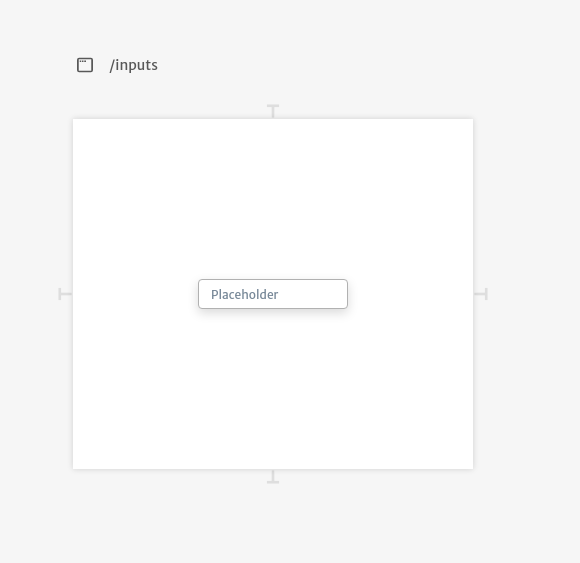
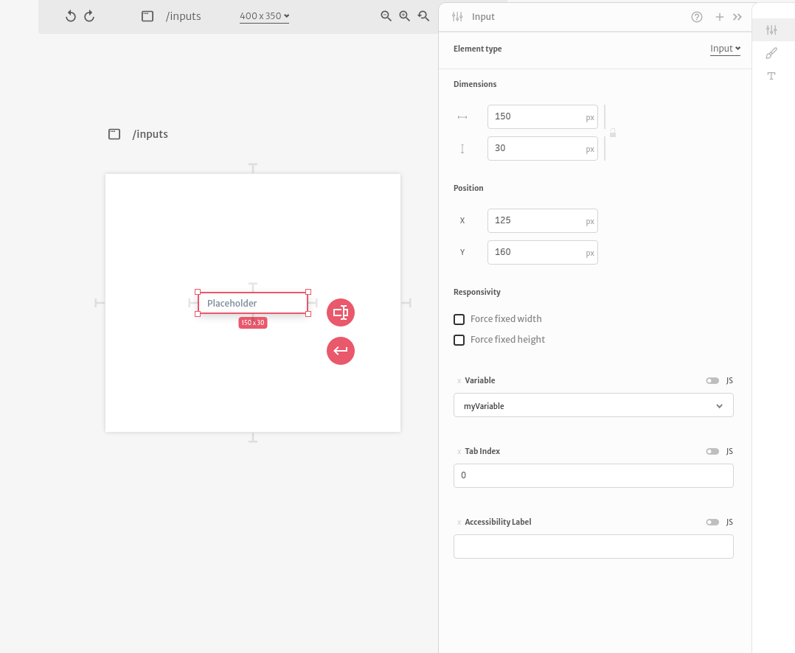
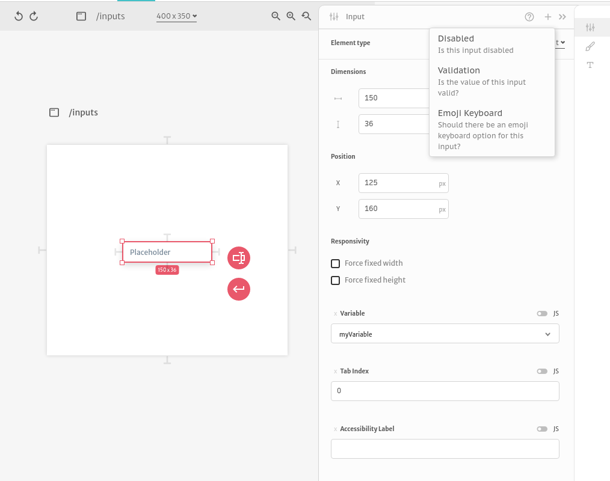
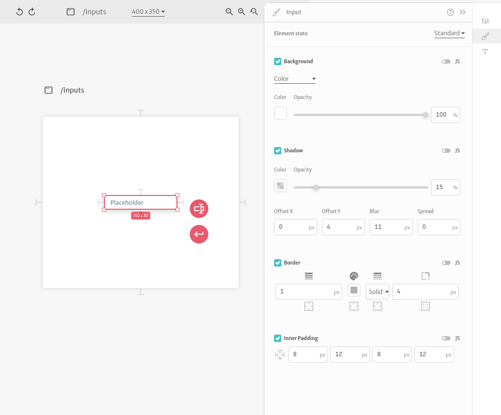
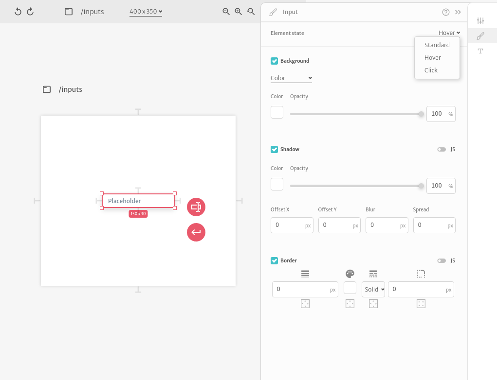
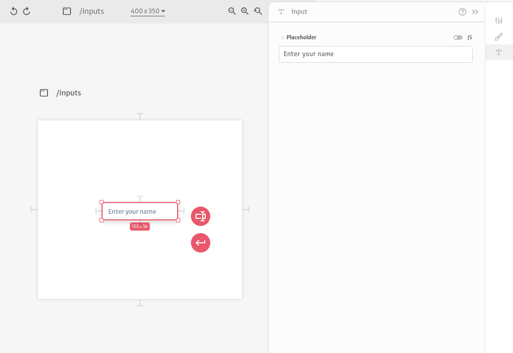

# Text

Text inputs are basic single line text inputs for your application. They are commonly used when building forms.

 A text input configuration is divided in 3 different sections. In the first section you can configure it's dimensions, position, responsivity and all of it's arguments.

Since `Dimensions`, `Position` and `Responsivity` are common to all elements, you can checkout more about how they work [here](../).

The `Variable` argument is useful for binding an input value to a variable of your application. `Tab Index` and `Accessibility Label` are used to configure how screen readers interact with your application. Other than this default arguments, you can also configure if the input is `Disabled`, a input value `Validation` and if it has an `Emoji Keyboard`.

The  second configuration section let's you change you input styles. You can change it's `Background`, `Shadow`, `Border` and `Inner Padding`.

Except for the `Inner Padding`, you can change the styles based on user interaction. They all have a `Standard` state configuration but you can change styles during `Hover` and `Click` interactions as well.

The  third configuration section let's you change you input `Placeholder`.

