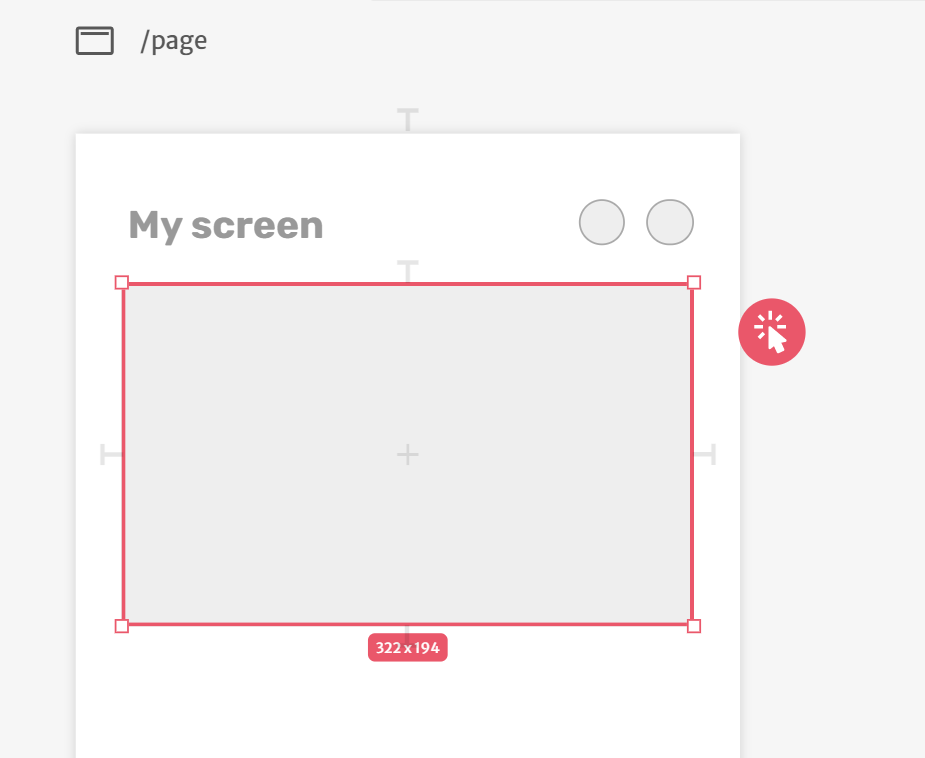
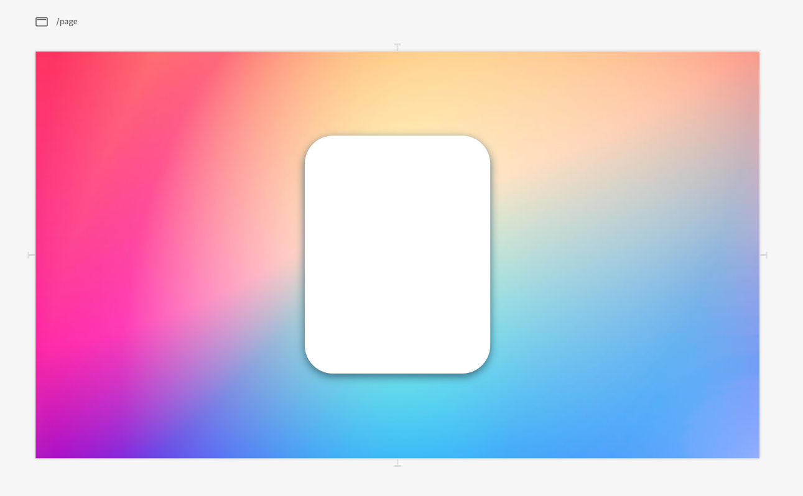
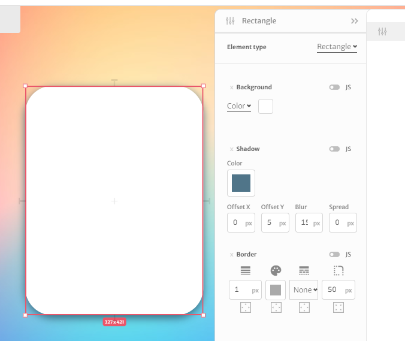
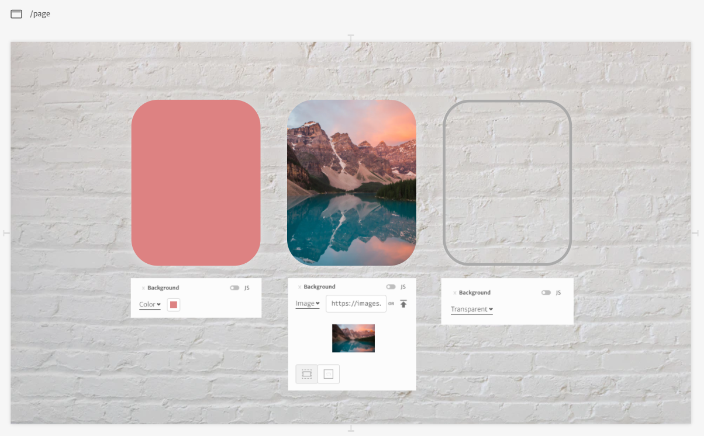
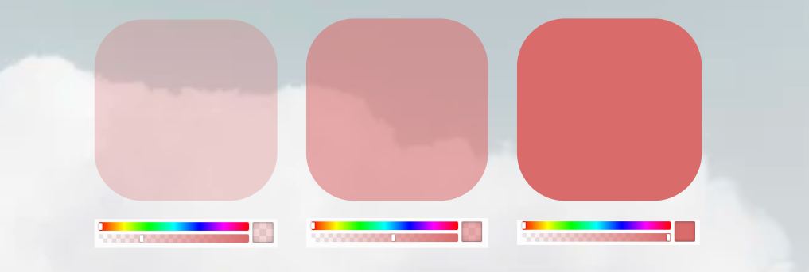
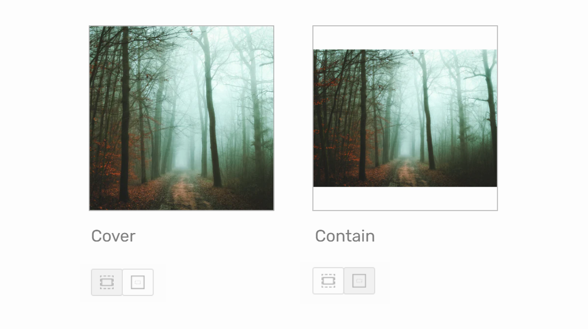
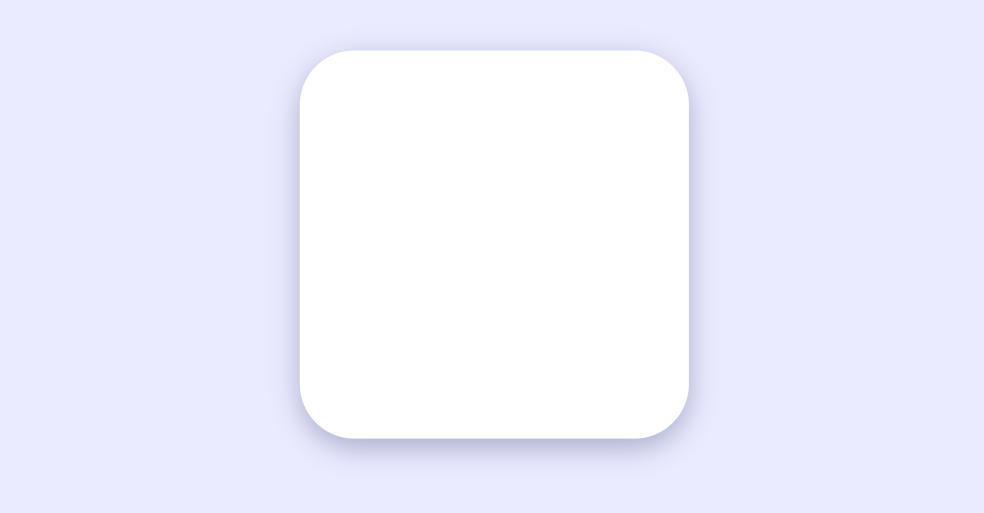
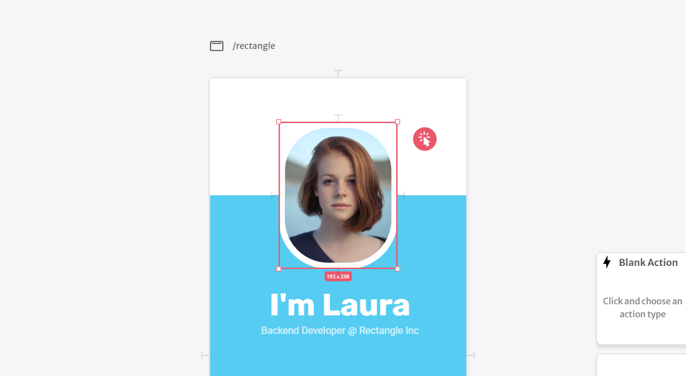

# Rectangle

It is a simple rectangular form that you can use on your layouts.

The rectangle can be stretched to assume the dimensions you want. You can also edit many visual properties like color, border radius, shadow, and more, so it can serve many purposes.

### Editing visual properties

To edit its visual properties, you need to use the sidebar on the right side of the screen.

#### Background

For the background, you have the option to use a solid color, an image, or even make it transparent.

Using color as the background, you can also control the transparency.

If you use an image for the background, you can choose how it will fill the rectangle. If you select "Cover", the image will fill all the space of the rectangle, even if the edges of the images have to be cut. Otherwise, selecting "Contain", the image will be resized to make sure it is fully visible inside the rectangle.

#### Shadow

You can also add a shadow to your rectangle and adjust its properties, like blur and color. _To **remove** the shadow, you can set all its numeric properties to 0px._

**Offset X** \(horizontal offset\) defines the displacement in the X-axis in relation to the element. It can be positive or negative.

**Offset Y** \(vertical offset\) defines de displacement in the Y-axis. It can also be positive or negative.

**Blur** defines how blurred the shadow will be. If set to 0, the shadow will be sharp, similar to a border. The higher the number you define, the more blurred the shadow will be. 

**Spread** increases the overall size of the shadow, defining the distance between its blurred part and the element.

**Color** is also a property that you can change to create different visual effects on your interface. 

### Border

You can also control the border of your rectangle. _To **remove** it, you should set the border style to "None"._

