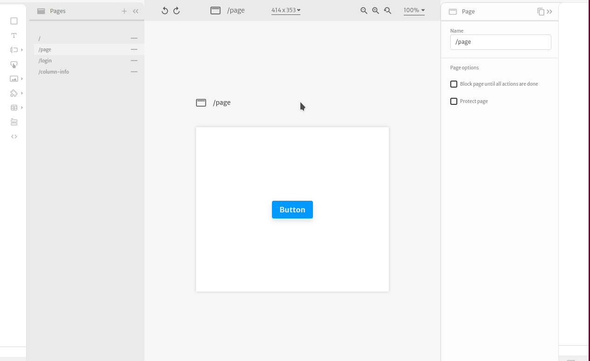
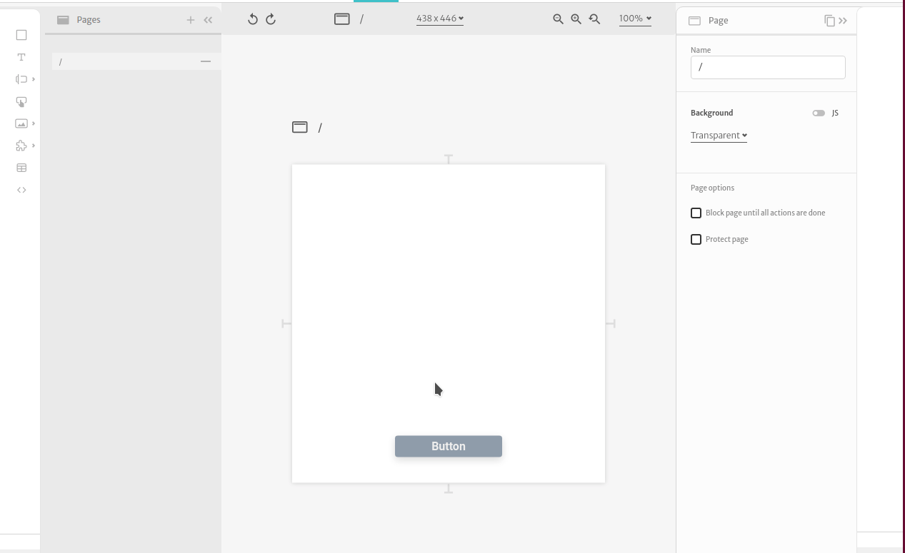

# Subview

The **subview** element lets you choose where and how to easily add your custom created components in a page. It is specially helpful if you have _**lots**_ of **custom components**

Use this component as a placeholder slot for you to add and organize your component canvas

### Arguments

#### subview

The component to be rendered.  
Format: [subview](https://docs.abstra.app/docs/front-end/arguments/argument-types#subview)

#### overflow

_\(Only in the elastic engine\)_ What to do when the selected component exceeds its limits. Options are:

* Hidden \(value `hidden`\): Do not show the exceeded content
* Auto \(value `auto`\): Scroll when needed
* Visible \(value `visible`\): Display the exceeded content anyway 

Format: discrete [text](https://docs.abstra.app/docs/front-end/arguments/argument-types#text)  
Default: `hidden`

### Events

The following are the events triggered by this element:

#### On click

When this element is clicked, a `click` event is triggered and actions with this trigger will be initiated. No additional information is loaded on the context.

