# Text

This element lets you show rich text, such as paragraphs or a simple label.

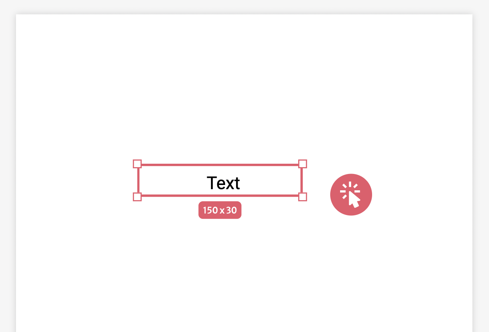

With it you can format your text to your heart's content. The customization possibilities varies from choosing if your text is in italic to actually specifying the Line Height of a paragraph.

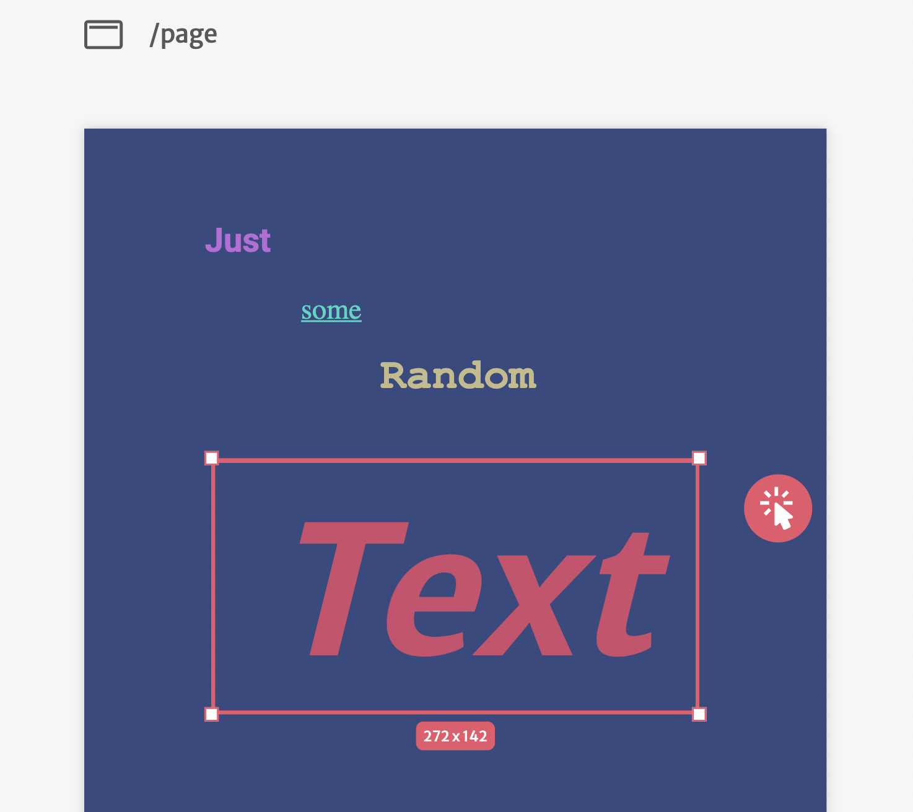

### Editing visual properties

To edit its visual properties, you need to use the sidebar on the right side of the screen.

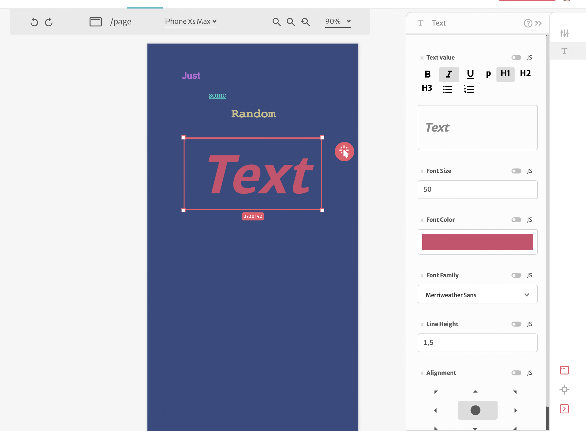

#### Text Value

In this field you'll input the value that you want in your text. In order to do that you also have several options to help you customize such as:

* Bold
* Italic
* Underline

Toggling them will change how your future text in this element will be written.

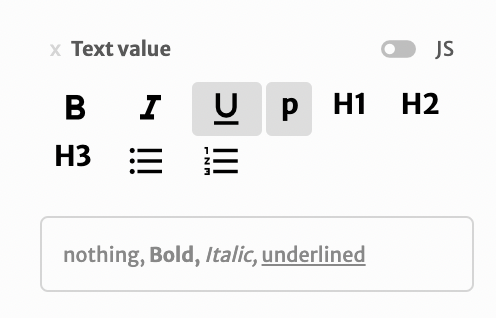

Then we have:

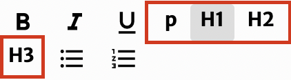

* Paragraph
* Header 1
* Header 2
* Header 3

Toggling them will change how the selected line in the text in this element to the designed choice

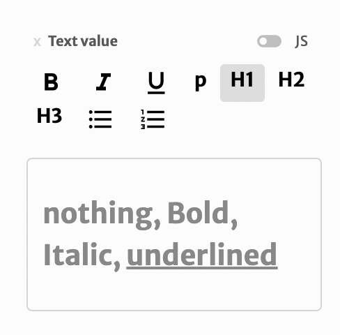

And finally we have:

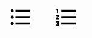

* Bullet list
* Numbered List

Toggling them will change the selected line in the text to the respective list

#### Font Size

Here you can adjust, in numbers, the size of the font that your text will be written. 

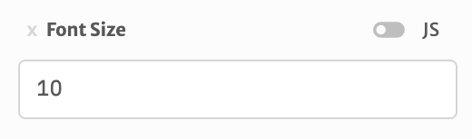

#### Font Color

In this field you can choose the color of your font.

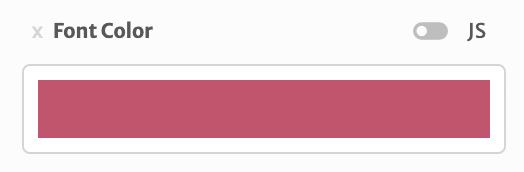

When you click in it, a color picker should pop up to turn your experience picking the color easier.

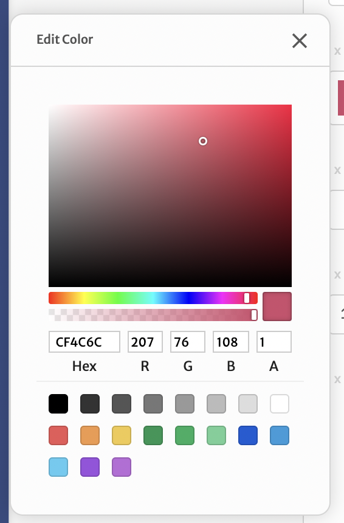

In it you can pick directly on the screen or write down the hexadecimal/rgb code if you already have something more precise in mind.

#### Font Family

Here you can pick the font family used in your text element

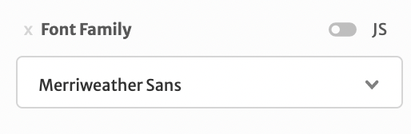

When clicking on this field it will show a list of some fonts we have already added in our platform.

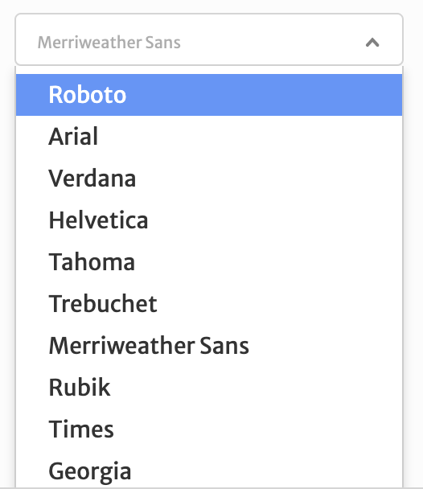

We are adding more and more fonts as times passes, feel free to suggest one :\)

#### Line Height

Here you will be able to define the height of the lines within your text. _The values that you can choose here should be all positive and can be non integers._

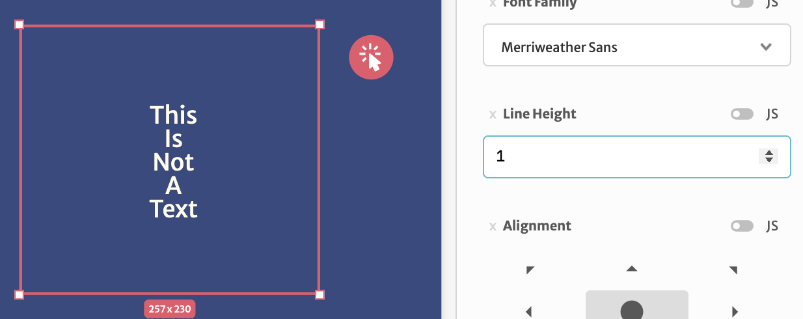

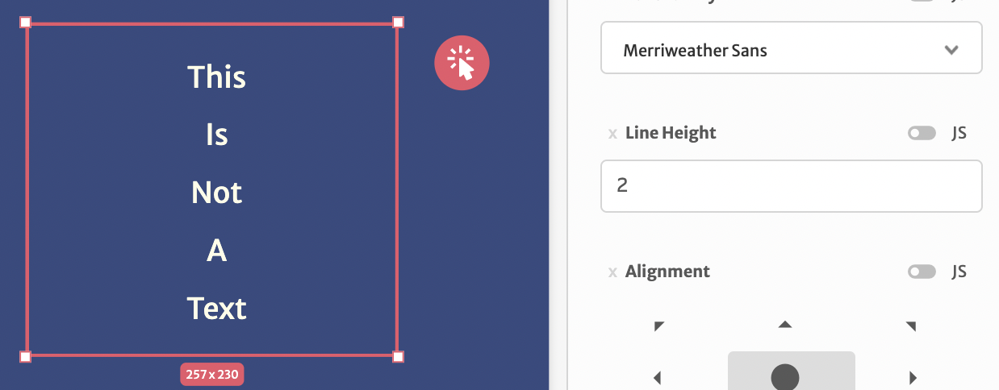

#### Alignment

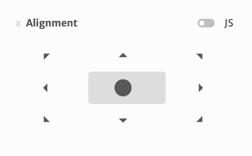

Here you should define where your text will be aligned. You can choose within 9 different options: Top-Left, Top, Top-Right, Left, Center, Right, Bottom-Left, Bottom, Bottom-Right.

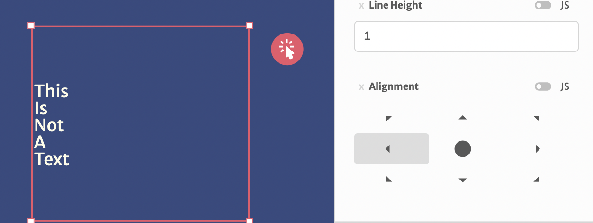

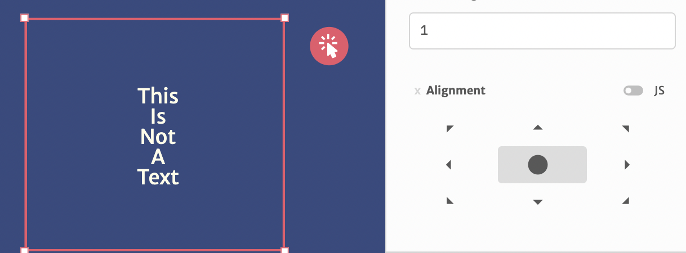

