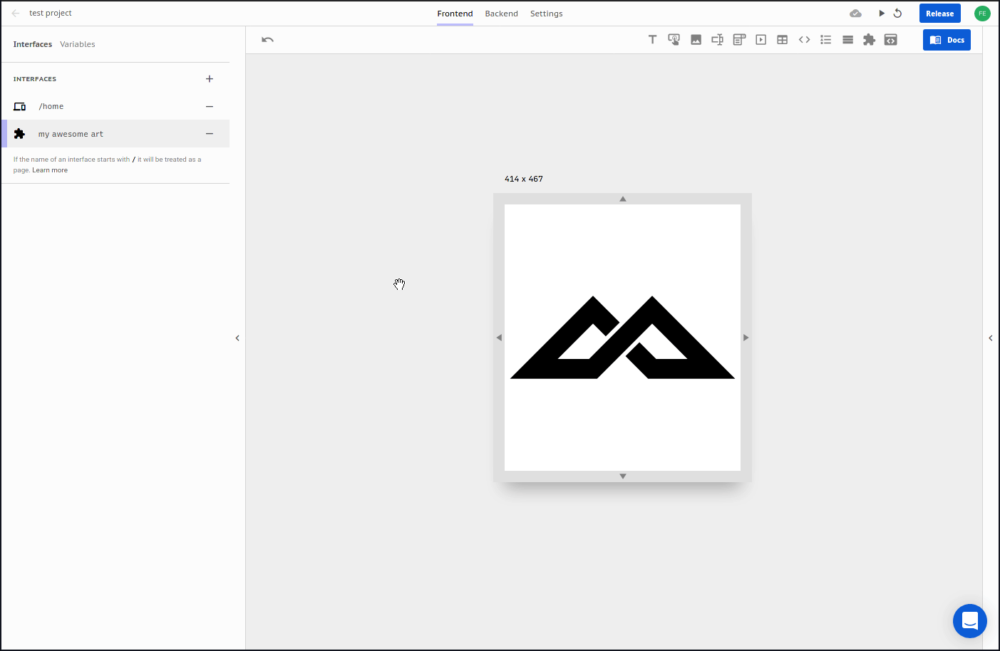
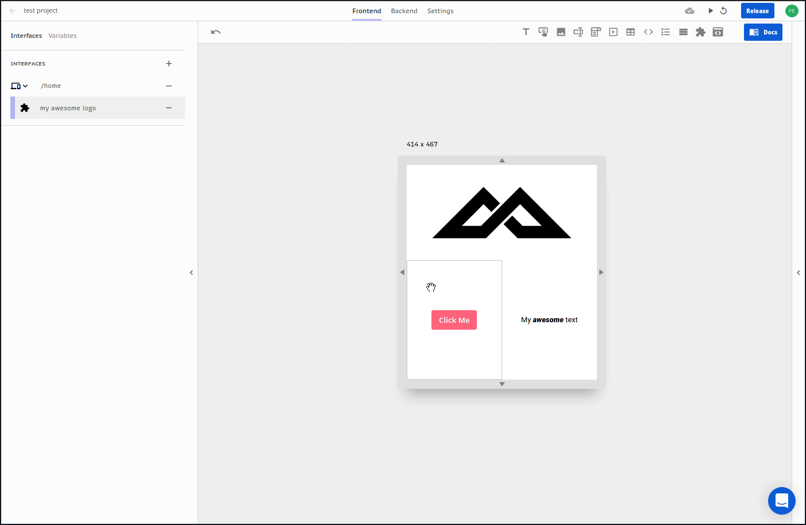

# Pages

Interfaces are the building block of your front-end app that house the [slots](../slots/) for the [components](../elements/).

You can name and nest them to organize your project

And clone them for fast development

