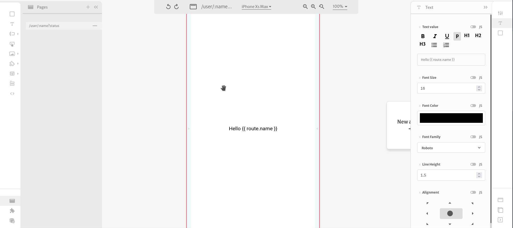

# Route parameters

It is possible to create two different types of _route parameters_ in your page by changing the page name:

```text
/my-page/:param1/:param2
```

This way, if the user goes to the route `/my-page/1/2`, the values of `param1` and `param2` will be 1 and 2 respectively.

```text
/my-page?param1&param2
```

This way, if the user goes to the route `/my-page?param1=1&param2=2`, the values of `param1` and `param2` will be 1 and 2, respectively.

The values of the route parameters can be accessed through the route object, both in [visual mode](../arguments/mustache-notation.md) and [expression mode](../arguments/expression-mode.md)



