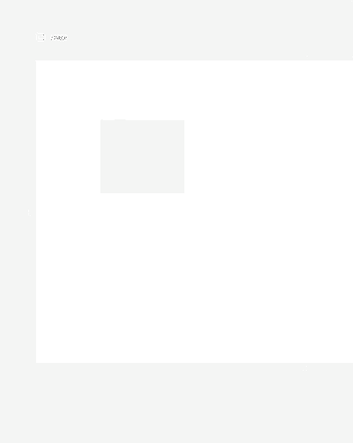

# Shortcuts

Whenever you are on our editor page you'll have some shortcuts to actually help you on the layout of your web app. :)

Here you can find a list of them:

#### Fine Adjusting a Selection

With the **Arrow keys **you can fine adjust any selection you make. That way you can guarantee your component is where you want.

#### Select All Components

By pressing **Ctrl/Cmd + A **you can select all the components within your view.

#### Copy & Paste

By pressing **Ctrl/Cmd + C**, **Ctrl/Cmd + V** you can copy your components and paste them within any page or object on your workspace.

#### Delete Selection

Delete your selection by pressing the **Delete** button.

#### Duplicate Selection

By pressing **Ctrl/Cmd + D** you can duplicate all your components within your selection.

#### Group Selection

By pressing **Ctrl/Cmd + K** you can group your selection within a subview. Letting you reuse it and facilitate editing.

#### Ungroup Subview

If you want to separate the components within a subview again and bring them to the view just press **Ctrl/Cmd + Shift + K**.

#### Undo & Redo

Editing something and made a mistake? Don't worry. Just undo it with **Ctrl/Cmd + Z** and keep working on your app.

Also if you change your mind and now decided that it was not a mistake at all just go with ** Ctrl/Cmd + Shift + Z**.

.gif>)

#### Fix Line of Movement on Drag

While dragging a component, keep **Shift** pressed to fix the line of movement of that component on the horizontal or on the vertical.

#### Proportional Resize

If you want to resize your component, but don't want it to lose its proportion just keep **Shift **pressed while doing so.

#### Mirrored Resize

If you want to resize your component on mirrored fashion, just keep **Alt** while doing so.

#### Duplicate By Dragging

While you are selecting some components in our editor you can easily duplicate them by keeping **Alt** pressed**,** drag the component and drop it where you want your duplicate to be. 

###
