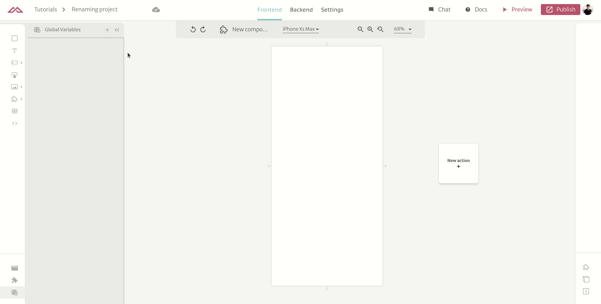
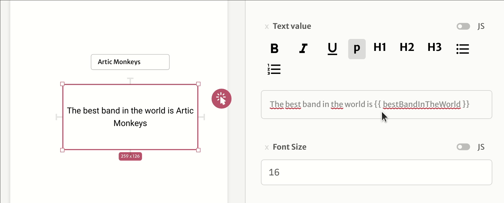

# Variables

In Abstra, you can create variables to help you manage your application state.

As in maths, variables are a 'tool' that you can define a value to and reutilize it in multiple points of your app. Let's say I create a variable named `bestBandInTheWorld`, and give it the value `Arctic Monkeys`. So if I utilize my variable anywhere in my code it would represent `Arctic Monkeys`.

Ie:  
The text `The best band in the world is {{ bestBandInTheWorld}}` will be rendered as `The best band in the world is Arctic Monkeys`

You can also change the value of your variable at any time in your application as you please, that way if you want that your variable to changes depending on the rules of your application, change them.

