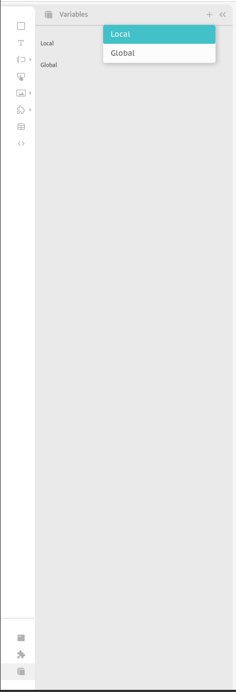
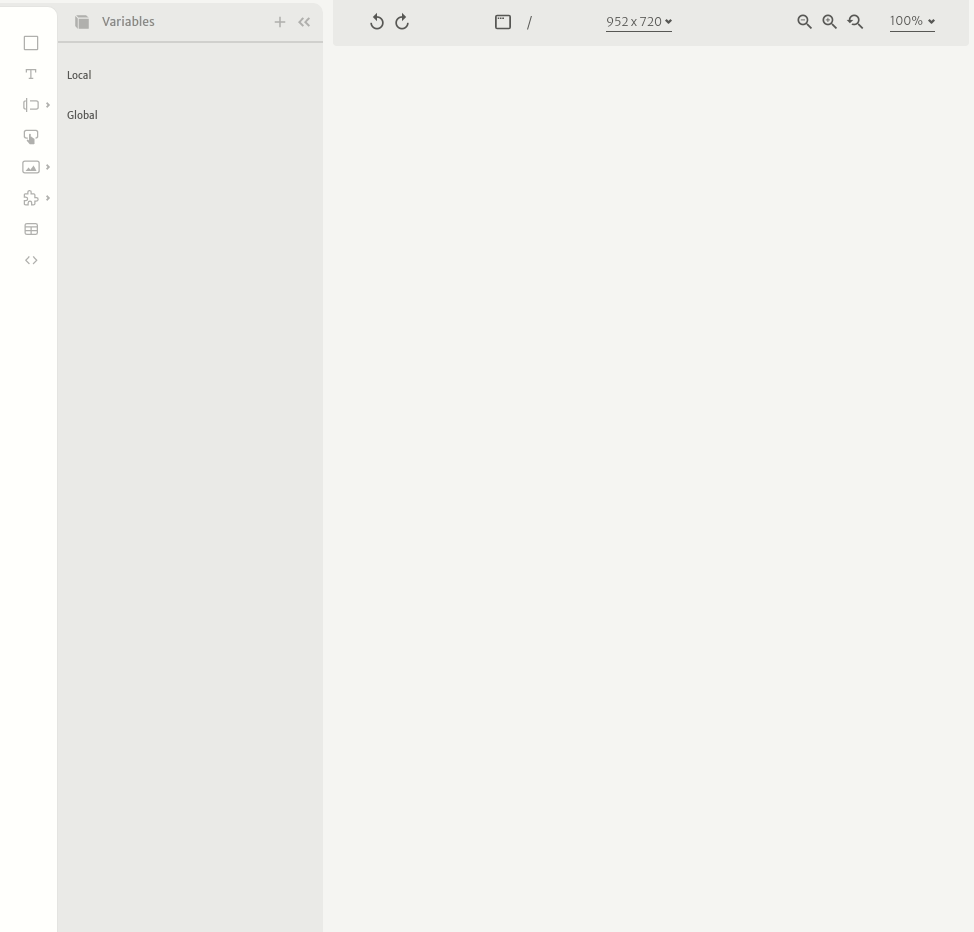
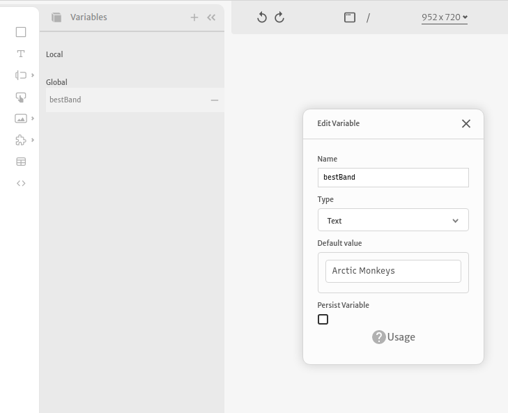
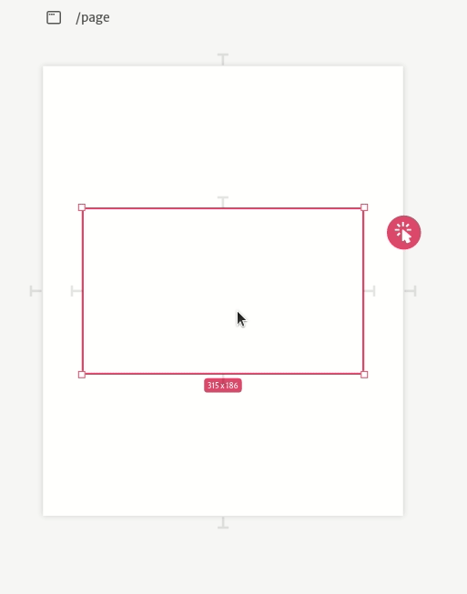
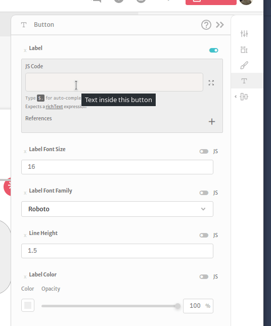
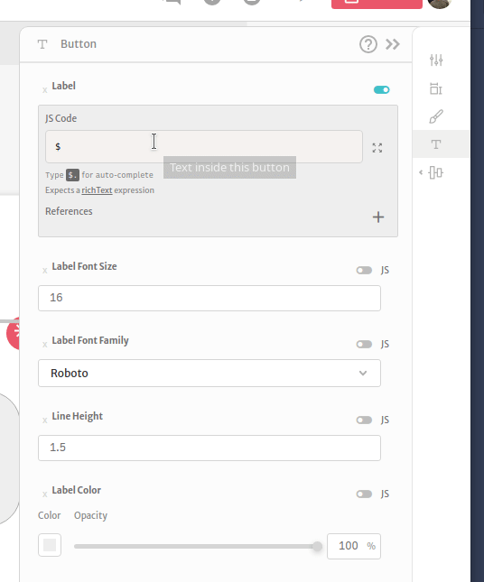

# Variables

In Abstra, you can create variables to help you manage your application state. You can create or delete variables at the variables section of the left sidebar.

Variables can be `Local` or `Global`. `Global` variables can be accessed or modified in any `Page` or `Component` of your application. `Local` variables are bound to `Pages` or `Components`, so they can only be accessed and modified inside them.

You can configure a variable's name, type, default value and persistence.

As in math, variables are a "tool" that you can define a value to and reutilize it in multiple points of your app. Let's say I create a variable named `bestBand`, and give it the value `Arctic Monkeys`. So if I utilize my variable anywhere in my code it would represent `Arctic Monkeys`.

The text `The best band in the world is {{ bestBand }}` will be rendered as `The best band in the world is Arctic Monkeys.`

You can also change the value of your variable at any time in your application as you please, that way if you want that your variable to changes depending on the rules of your application, change them. You can read more about how to change a variable's value at the [Set variable action section](actions/set-variable.md).

The `bestBand` example shows how to read a variable using [Mustache notation](arguments/mustache-notation.md) but they can also be accessed using the [Expression mode](arguments/expression-mode.md). Read more on how to use your variables at these sections.

### Variable Types

Abstra comes with 7 different variable types: &#x20;

.png>)

* **Text**: any text value you may want to store, such as names, urls, and other textual information
* **Yes/No**: any boolean values. For example you might want to store if a user has clicked a button
* **Number**: any numerical values, decimal or integer
* **Image**: the same as a text variable but it preview the result of the image URL
* **Array / List**: when you want to store a list, for example the results of  a [Checkbox](elements/inputs/checkbox.md) with multiple answer allowed.
* **Object / Dictionary**: when you have more complex variables and it can have fields inside. For example you can have a meeting object like the following:

.png>)

* **Anything**: a variable that accepts any of the other types above.

#### Table Types

When you have some hosted tables created, you can create variables with types according to them:

 (1).png>)

.png>)

The first is typed as a single row of the table, so you can get auto suggestions for the complete row or each column:

The second is typed as a list of rows, just like the result of a [Query](actions/hosted-tables.md), so you can get suggestions for the list, the size of the list, the first row and its columns:&#x20;

