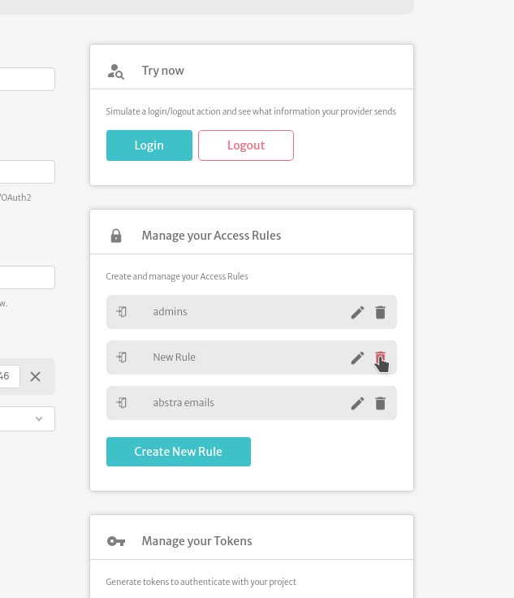

# Authentication

Abstra allows you to use your own authentication provider (OIDC and OAuth2.0) for in app authentication / authorization. You only need to fill the **`Authority`** (the URL of the provider) and the **`Client ID`** (your client application's identifier as registered with the OIDC/OAuth2 provider).

 (1) (1) (1).png>)


For this to work you need to allow `https://*.abstra.app/sign-in` as a callback URL and `https://*.abstra.app/sign-out` as a logout URL&#x20;


#### Extra configurations

If your authentication flow requires, you may also need to fill the **`client secret`**

 (1) (1).png>)

Some providers don't implement some features that Abstra requires, so you have to overwrite the OIDC metadata. In this case, Abstra tries to fill them automatically (such as Auth0's `end_session_endpoint`), but you may have to fill them yourself, or get in touch with us.

 (1) (1).png>)

There are several authentication providers services. Abstra itself uses Auth0. Learn how to integrate Auth0 into your application here: [Authentication with Auth0](../../tutorials/common-tecniques/auth-with-auth0.md).

### Test your login flow

You can simulate a login/logout action and see what information your provider sends you

Right bellow will appear a box containing all the information the provider sends, which can be accessed with the user context variable with `$.user` or `{{ user }}`.\
For example name can be accessed with `$.user.profile.name` or `{{ user.profile.name }}`.

 (1) (1).png>)

### API Tokens

Abstra allows you to authenticate method/statement calls without an user token with **api tokens**. Check how to use them in [calling methods/statements outside Abstra apps](../../tutorials/common-tecniques/calling-connectors-or-tables-from-outside-abstra.md).

 (1).png>)

### Access Rules

To protect some assets, Abstra allows you to create and set access rules for them.

.png>)

Access rules can be of the **`user`** or **`role`** type.&#x20;

For the **`user`** type you can specify emails addresses (including wildcards ex: `*.sales@abstra.app`) that will only allow users that match at least one email.

 (1) (1).png>)

For the **`role`** type you need to specify the path of the role inside the user profile. For example, when we tested our login we got the following information from the provider:

 (1) (1).png>)

Notice that inside the profile object there is an entry named **`https://example.com/roles`** (per OIDC standards the key must be an **uri**, but it may vary in your provider). That entry is the roles list in our case, so we can configure the access rule as follows:

 (1) (1).png>)

To see an example check out [using Auth0 roles](../../tutorials/common-tecniques/auth0-roles.md).
