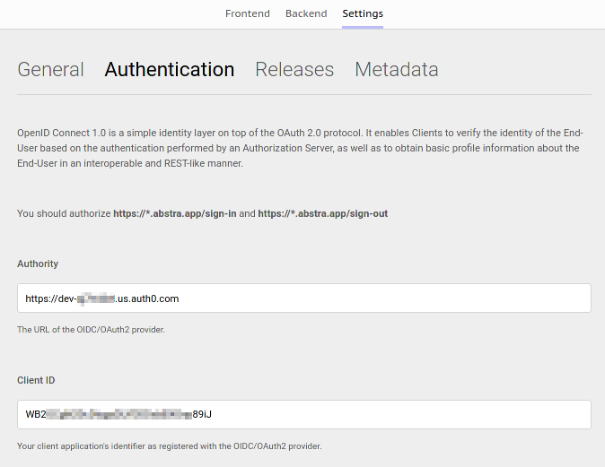

# Authentication

Abstra allows you to use your own authentication provider \(OIDC and OAuth2.0\) for in app authentication / authorization.


OpenID Connect 1.0 is a simple identity layer on top of the OAuth 2.0 protocol. It enables Clients to verify the identity of the End-User based on the authentication performed by an Authorization Server, as well as to obtain basic profile information about the End-User in an interoperable and REST-like manner.


For this to work you need to allow `https://*.abstra.app/sign-in` as a callback URL and `https://*.abstra.app/sign-out` as a logout URL and fill the `Authority` \(the URL of the provider\) and the `Client ID` \(your client application's identifier as registered with the OIDC/OAuth2 provider\).

Example:

There are several authentication providers services. Abstra itself uses Auth0. Learn how to integrate Auth0 into your application here: [Authentication with Auth0](../../tutorials/common-tecniques/auth-with-auth0.md).

