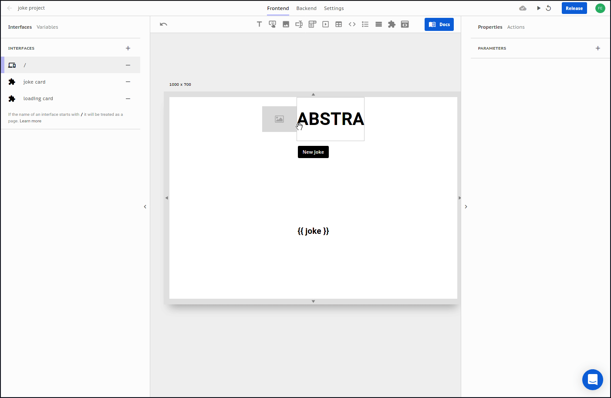

# Projects

Abstra projects are fully-fledged applications.

You can build a SPA [front-end](front-end/), have it reading and writing to a [database]() and [calling external APIs]() and with one click have a production ready and shareable link of your released project.

Abstra projects are composed of three main sections







