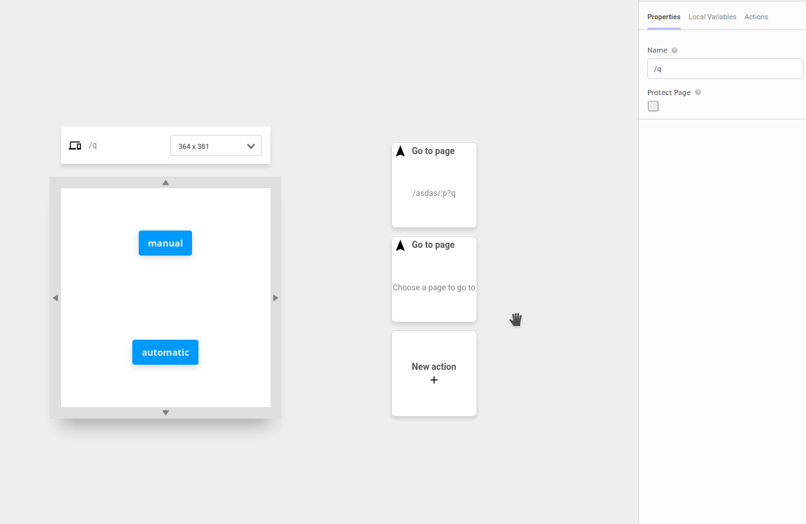

# Go to page

This action reroutes the user to a different page in your application

## Arguments

### Route

What's the route of the page in your application you wish to redirect the user.  
Format: [route](https://docs.abstra.app/docs/projects/front-end/arguments/argument-types#route)

## Outcomes

### Then

Action to be performed after the user is redirected to the new page.  
No additional information is injected in the context.

