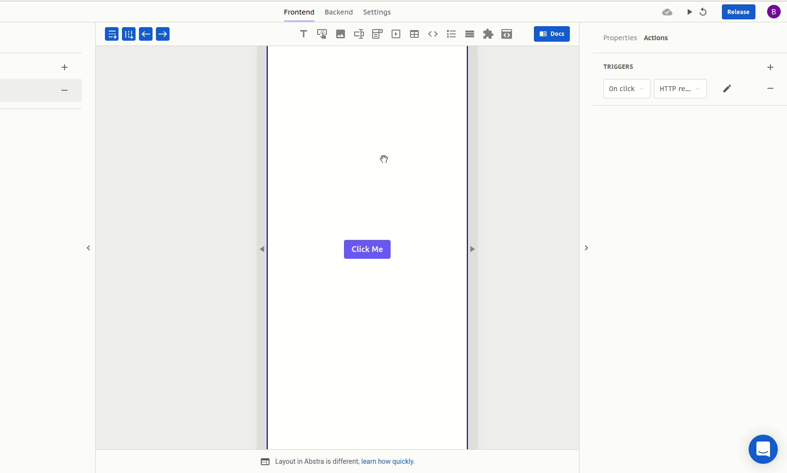

# HTTP Request

This action is used to make HTTP requests to an external API.

## Arguments

### URL

The URL of the API for the HTTP request  
Format: [text](https://docs.abstra.app/docs/projects/front-end/arguments/argument-types#text)

### HTTP Method

The method of the HTTP request. It should be one of `GET`, `POST`, `PUT`, `PATCH`, `DELETE` or `OPTIONS`  
Format: discrete [text](https://docs.abstra.app/docs/projects/front-end/arguments/argument-types#text)  
Default: `GET`

### Headers

The header of the HTTP request. It should be a JSON object where the keys are the header fields, and the values are its respective values.  
Format: [json](https://docs.abstra.app/docs/projects/front-end/arguments/argument-types#json)

### Loading type

The loading feedback displayed while the request is being performed and processed. Possible values are:

* Block screen \(value `overlay`\): a loading feedback will cover the screen
* No feedback \(value `none`\): no feedback is displayed.

Format: discrete [text](https://docs.abstra.app/docs/projects/front-end/arguments/argument-types#text)  
Default: `overlay`

### Body

The body of the HTTP request. It should be a JSON object where the keys are the header fields, and the values are its respective values.  
Format: [json](https://docs.abstra.app/docs/projects/front-end/arguments/argument-types#json)

## Outcomes

### Success

The action you wish to execute after the request is successfully made. The response is fed into the context as the response variable, accessible through mustache notation as `{{ response }}` or in the expression mode as `$.response`

### Failure

The action you wish to execute if something goes wrong with the request. The error is fed into the context as the error variable, accessible through mustache notation as `{{ error }}` or in the expression mode as `$.error`

