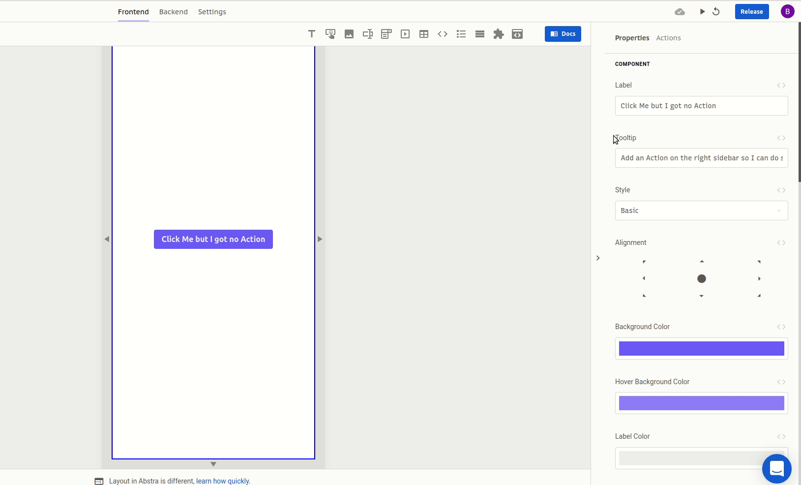

# Show message

This action is used to display a modal in the screen with a message for the user.

### Arguments

#### Title

Title of the message displayed  
Type: [text](https://docs.abstra.app/docs/projects/front-end/arguments/argument-types#text)

#### Message

Content of the message displayed  
Type: [text](https://docs.abstra.app/docs/projects/front-end/arguments/argument-types#text)

#### Icon

Icon displayed in the message's modal. The options are:

* Success \(value `success`\)
* Error \(value `error`\)  
* Warning \(value `warning`\)   
* Information \(value `info`\)  
* Question mark \(value `question`\)

Type: discrete [text](https://docs.abstra.app/docs/projects/front-end/arguments/argument-types#text)

### Outcomes

#### Then

What happens after the person closes the message.  
No additional information is loaded on the context.

