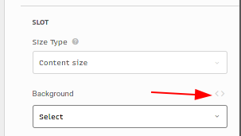
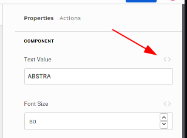
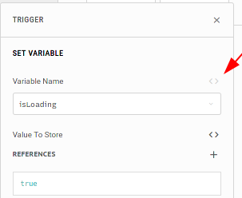

# Arguments

In Abstra, most behaviors and appearances are controlled with arguments.   
They are user defined properties of [slots](../slots/), [components](../elements/) and [actions](../actions/).

You can easily identify arguments by their signature [expression mode](expression-mode.md) toggle button.

You have two different ways of filling arguments: 

* the default UI for each [type](argument-types.md) that has static behavior. For example if you set a text value argument of a [text component](../elements/text.md) with its stock UI to `Foo Barr`, it will always display that text on the [slot](../slots/). Note that even though it is a static field you can use the [mustache notation](mustache-notation.md) as a template utility.
* the expression mode, a text area where you can write JavaScript code and complex logic. For example if you set a text value argument of a [text component](../elements/text.md) with expression mode to `$.isLoading ? "Loading" : "Done!"`, it will check the `isLoading` context [variable](../variables.md) to decide if its going display `Loading` or `Done!`. \(Yes, that is a ternary operator, see more on [expression mode](expression-mode.md)\).

