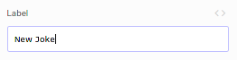
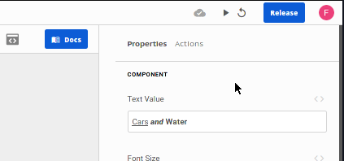

# Argument types

### text



#### UI

Text input. This input parses [mustache notation](mustache-notation.md).

#### Expression Mode

It's expected an expression that will be evaluated as a string.


Interpolation can be achieved using JavaScript templating sintax.  
Example: if there is a context text variable called `name` and the expression is ```My name is ${ $.name }```, on preview mode the variable value will replace it.


### richText



#### UI

Rich text input.  
Selecting brings the rich text editor with options such as **bold**, _italic_ and `code`. Rich text shortcuts are also available.

#### Expression Mode

It's expected an expression that will be evaluated as a string.  
For rich text formatting use html tags.

### number

Number

#### UI

Number input with up and down buttons.

#### Expression Mode

It's expected an expression that will be evaluated as a number.

### boolean

### component

### componentId

### componentMethod

### variable

### code

### json

### js

### html

### css

### color

Simple color represented by a named color \(white, black, green, ...\) or hex values with opacity.

#### UI

Color picker with hex values, opacity and default colors.

#### Expression Mode

It's expected an expression that will be evaluated as a string representing [CSS colors](https://developer.mozilla.org/pt-BR/docs/Web/CSS/color_value).

### alignment

Aligment of a component inside a slot.

#### UI

Aligment input. Default is `center`.

#### Expression Mode

It's expected an expression that will be evaluated as one os the following strings:

* `top`
* `left`
* `right`
* `center`
* `bottom`
* `top-left`
* `top-right`
* `bottom-left`
* `bottom-right`

### background

### padding

The spacing between the contents and its border.

#### UI

Default four number inputs for top, bottom, left and right paddings.  
Alongside the inputs there is a checkbox that unifies them in pairs \(`top + bottom`, `left + right` and `vertical + horizontal`\).

#### Expression Mode

It's expected an expression that will be evaluated as an object containing the following properties \(the dimension property must be one of [CSS units](https://www.w3schools.com/cssref/css_units.asp)\):

```text
{
  "top": { "value": 8, "dimension": "px" },
  "bottom": { "value": 8, "dimension": "px" },
  "left": { "value": 16, "dimension": "px" },
  "right": { "value": 16, "dimension": "px" },
  "sameAll": false,
  "sameHorizontal": true,
  "sameVertical": true
}
```

### shadow

The shadow beneath the component.  
Shadow offsets for vertical and horizontal axis, spread, blur and color properties can be set.

#### UI

Four number inputs for offset x , offset y, blur and spread and a color picker for the shadow color.

#### Expression Mode

It's expected an expression that will be evaluated as an object containing the following properties:

```text
{
  "x": 0,
  "y": 0,
  "color": "rgba(0, 0, 0, 0.15)",
  "blur": 0,
  "spread": 0
}
```

### border

Border properties: `width`, `color`, `style` and `radius`.  
All properties can be individualy set for each side.

#### UI

Two number inputs for border width and radius in pixels, one color picker for border color and one options input for border style \(available styles are none, solid, dashed and doted\).  
All inputs have a button alongside them that allows for individual setting of the property.

#### Expression Mode

It's expected an expression that will be evaluated as an object with the following properties \(where the `style` property is one of `none`, `solid`, `dashed` or `dotted`\)

```text
{
  "width": 0,
  "style": "solid",
  "color": "rgba(0, 0, 0, 0.25)",
  "radius": 4
}
```

### template

### subview

### statementId

### columns

### options

### query

It can be remote or local

Remote refers to connectors or SQL queries

#### Expression Mode

When local, it allows any JS Array, eg:

```text
[ {name: "John", age: 45}, {name: "Anne", age: 34} ]
```

Also, it can be an object with the type

```text
{
    remote: false,
    data: [ HERE IS THE DATA HARDCODED ],
    arguments
}
```

When it is remote

It

### row

### route

### rowId

### tableId

### viewId

### expression

### image

Image file.

**UI**

Input direct URL for the image or upload the asset.

**Expression** Mode

It's expected an expression that will be evaluated as string containing the direct URL for the asset.

### graphql

