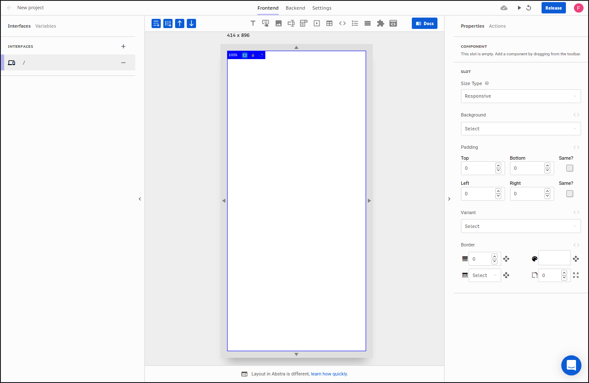

# Button

A simple clickable button.

### Arguments

#### Label

Text that will be displayed inside the button.  
Type: text  
Default: `Click Me but I got no Action`

#### Style

Styles presets that implement additional styling for the component. Options are:

* Basic \(value `basic`\): default preset with no additional styles implemented.  
* Full Width \(value `full`\): preset implementing width 100% for the button.   

Type: discrete text  
Default: `basic`

#### Alignment

Button alignment inside the slot.  
Type: alignment  
Default: `center`

#### Background Color

Color of the button's box.  
Type: color  
Default: `#6C63FF`

#### Hover Background Color

Color of the button's box when the cursor is hovering it.  
Type: color  
Default: `#8E85FF`

#### Label Color

Color of text inside the button.  
Type: color  
Default: `#EEEEEE`

#### Hover Label Color

Color of text inside the button when the cursor is hovering it.  
Type: color  
Default: `#FFFFFF`

#### Label Font Size

Size of the font of text inside the button.  
Type: number  
Default: `16`

#### Inner Padding

Spacing between the contents of the button and its border in pixels. Horizontal and vertical values only.  
Type: padding  
Default: horizontal `16px` and vertical `8px`

#### Shadow

Shadow of the button's box.  
Type: shadow  
Default: `0` for vertical and horizontal offset, blur and spread properties. `rgba(0, 0, 0, 0.15)` for shadow color

#### Border

Border of the button's box.  
Type: border  
Default \(for all sides\): `0px` for border width, `rgba(0, 0, 0, 0.25)` for border color, `solid` for border style and `4px` for border radius

#### Image

Icon that appears on the left side of the label inside the button's box.  
Type: image

### Methods

There is no method available for this component.

### Events

The following are the events triggered by this component:

#### On click

When this component is clicked, a `click` event is triggered and actions with this trigger will be initiated. No additional information is loaded on the context.

