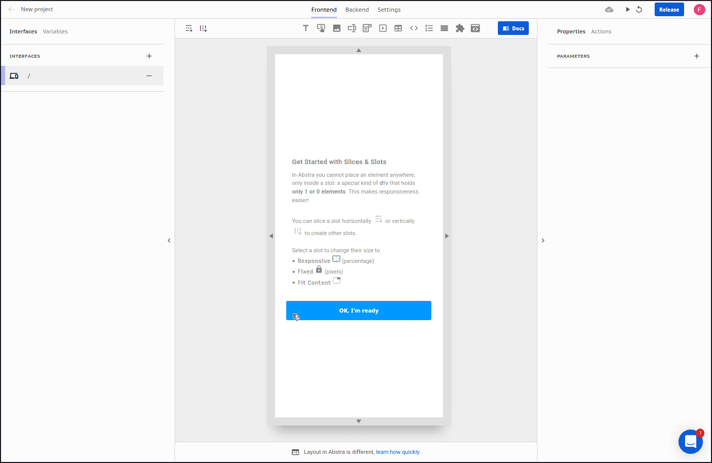

# iframe

This component lets you render external pages with its embed URL

### Arguments

**Source**  
Description: Iframe source URL  
Type: text  
Default: Area 51 map in Google Maps 

**Allow full screen**  
Description: Can this iframe be used in fullscreen?  
Type: boolean  
Default: `false`

