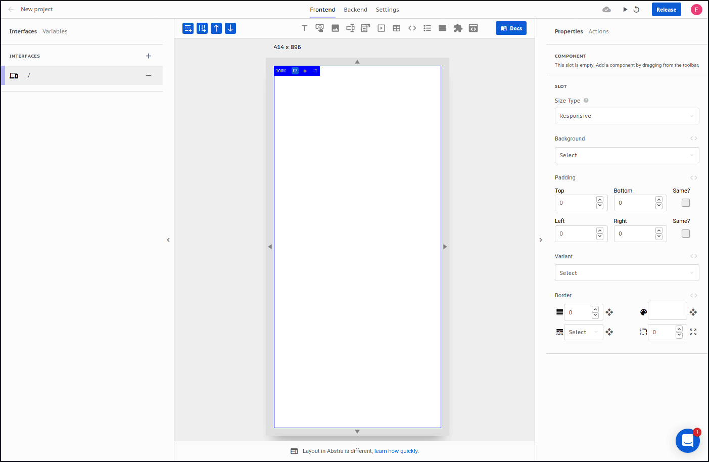

# Text

This component lets you show rich text.   
Common uses are titles, text content and descriptions.

### Arguments

#### Text Value

Text that will be displayed on the slot.  
Format: [richText](https://docs.abstra.app/docs/projects/front-end/arguments/argument-types#richtext)  
Default: `this is a text`

#### Font Size

Size of the font that will be displayed on the slot.  
Format: [number](https://docs.abstra.app/docs/projects/front-end/arguments/argument-types#number)  
Default: `16`

#### Font Color

Color of the font that will be displayed on the slot.  
Format: [color](https://docs.abstra.app/docs/projects/front-end/arguments/argument-types#color)  
Default: `#000000`

#### Line Height

Height of a line that will be displayed on the slot.  
Format: [number](https://docs.abstra.app/docs/projects/front-end/arguments/argument-types#number)  
Default: `1.5`

#### Alignment

Text alignment inside the slot.  
Format: [alignment](https://docs.abstra.app/docs/projects/front-end/arguments/argument-types#alignment)  
Default: `center`

### Methods

There is no method available for this component.

### Events

The following are the events triggered by this component:

#### On click

When this component is clicked, a `click` event is triggered and actions with this trigger will be initiated. No additional information is loaded on the context.

