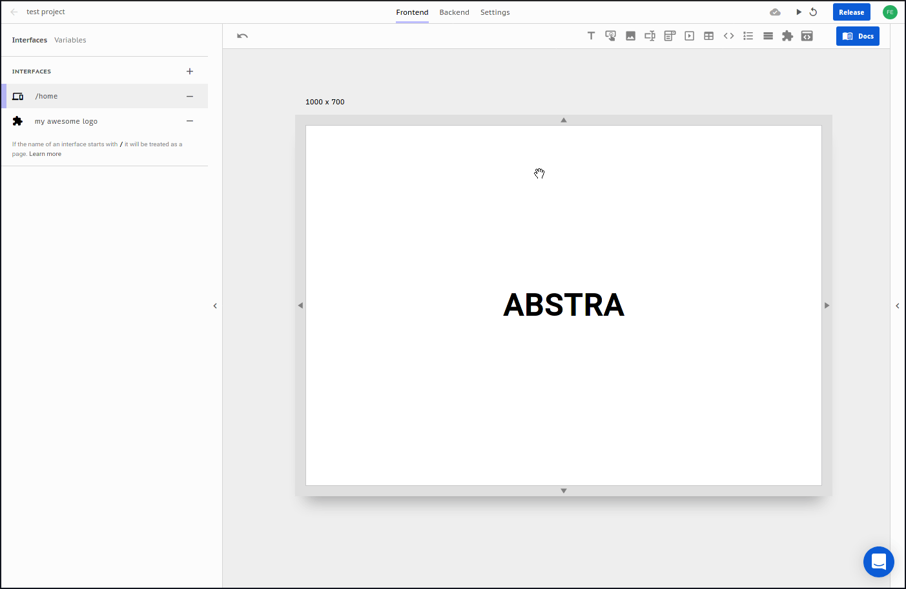

# Resizing

You can resize the interface two ways: **dragging** and **specifying a size**


Be aware that this size is not the final size on the released application but a tool to help users see how their design will appear in different devices. The actual size depends on the device screen.


## Dragging

You can use the side handlers to resize the interface.

Be aware that this size is not the final size on the released application but a tool to help users see how their design will appear in different devices. The actual size depends on the device screen.

## Specifying a size

For better control over how your application will be displayed on different devices you can specify a size or device by clicking on the device selector:

