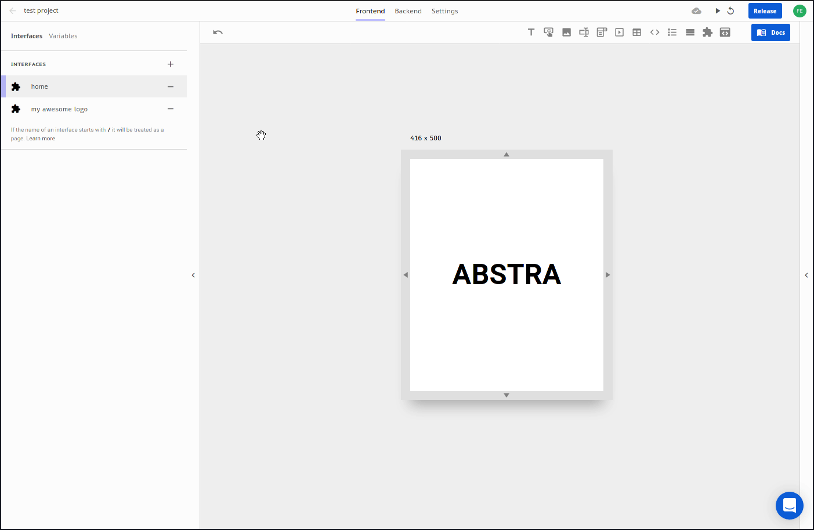

# Pages vs Interfaces

There are two types of interfaces: **generic interfaces** and **pages**

### Generic ****interfaces

Usually used inside other interfaces as a [reusable interface component](../elements/subview.md) for better design experience and maintenance of the application.

### Pages

Pages are the interfaces that will accessible via URL.

To change a generic interface to a page just put a `/` on the beginning of the name and it will be its path.

In the example above you will be able to access this interface with the URL `test.abstra.app/home` on the released application.

For more on routes and parameters visit [routes and nesting](routes-and-nesting.md).

