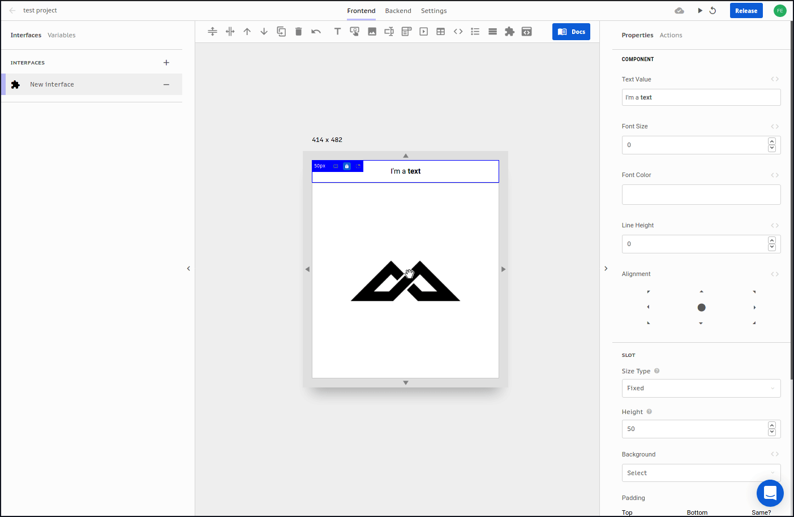
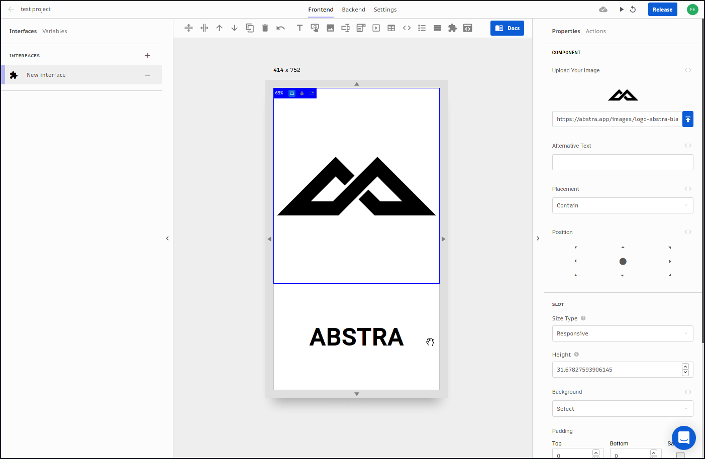
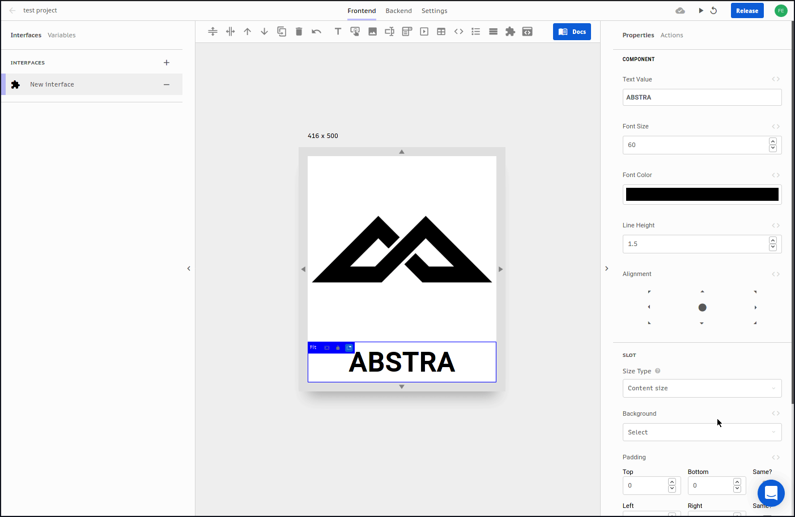

# Size Types

There are 3 size types for slots: **fixed**, **responsive** and **content size**.  
By default it is set to **responsive.**

## Fixed

Fix a number of pixels that does not change with different screen sizes

## Responsive

The size increases or decreases to persist its total proportion with different screen sizes

## Content Size

The size dynamically fits the content without empty spaces

