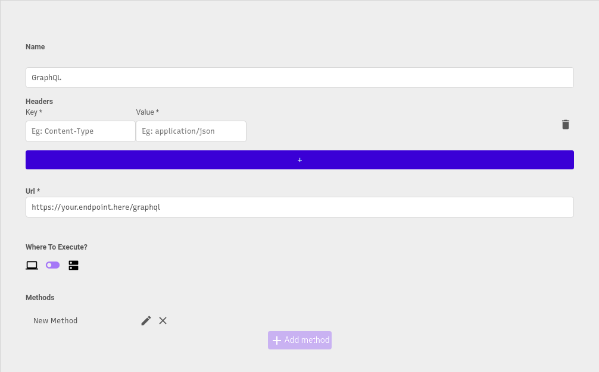

# GraphQL





You can write regular GraphQL here, for example:

```text
SELECT * FROM "Users" u WHERE u.name LIKE '%John%'
```

#### Passing parameters to the query

You can add **params** to your query by naming them **$variable**. When you use this query in the frontend, you can dinamically fill the parameters:

```text
SELECT * FROM "Users" u WHERE u.name = $name
```

Insert example:

```text
INSERT INTO "Users"(name, email) VALUES ($name,$email)
```

Update example:

```text
UPDATE "Users" SET name = $name WHERE u.email = $email
```

Delete example:

```text
DELETE FROM "Users" WHERE u.email = $email
```

