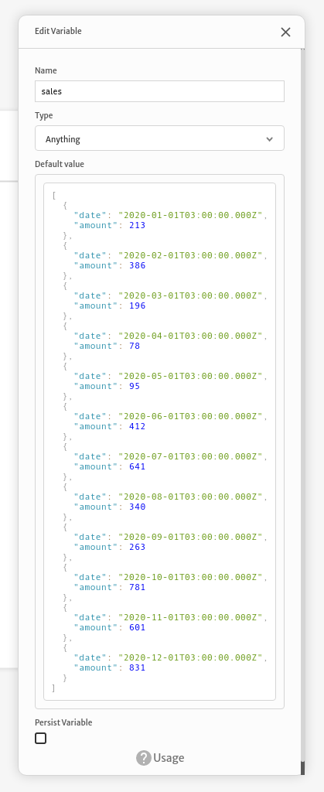

# Adding charts

Using something like [Google Charts](https://developers.google.com/chart) you can easily build dashboards inside Abstra. Let's build the following line chart as an example.


We have to start loading an external script from [Google Chart docs](https://developers.google.com/chart/interactive/docs/gallery/linechart) when our page is loaded.


The `Load external script` action is configured with the loader script URL and blocking any user interaction until it's loaded. You can read further on how to setup this kind of action [here](../../docs/front-end/actions/load-external-script.md).


Then you should add an HTML element to your page where the chart will be rendered by dragging and dropping it to your canvas.


Then you can set your `HTML` content to be a `div` element with an id of `my-chart` and configure it's `width` and `height` with some custom `CSS`.


Consider we have some data at our `sales` variable with the following format:

```javascript
[
  {
    "date": "2020-01-01T03:00:00.000Z",
    "amount": 213
  },
  {
    "date": "2020-02-01T03:00:00.000Z",
    "amount": 386
  },
  ...
]
```



Then we can use this data adding a script based on the [docs](https://developers.google.com/chart/interactive/docs/gallery/linechart) to render a line chart using the `Execute JavaScript code` action. You can read more about this action [here](../../docs/front-end/actions/execute-javascript-code.md).


The code we added is the following:

```javascript
google.charts.load('current', {packages: ['line', 'corechart']});
google.charts.setOnLoadCallback(drawChart);

function drawChart() {
  var data = new google.visualization.DataTable();
  data.addColumn('date', 'Month');
  data.addColumn('number', "Sales");
  data.addRows(
    $.sales.map(d => [new Date(d.date), d.amount])
  );
  var options = {
    legend: { position: 'bottom' }
  };
  var chart = new google.charts.Line(
    document.getElementById('my-chart')
  );

  chart.draw(data, options);
}
```

In this code we add all the basic setup from the docs and add the data rows using our sales variable

```javascript
data.addRows(
  $.sales.map(d => [new Date(d.date), d.amount])
);
```

Then we render the line chart inside our HTML element we added earlier

```javascript
var chart = new google.charts.Line(
  document.getElementById('my-chart')
);

chart.draw(data, options);
```

And after clicking to preview our application this is the end result


If you need to debug your draw chart action, you can always add a `Show message` action to catch errors and fix your chart.


