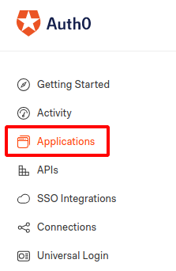
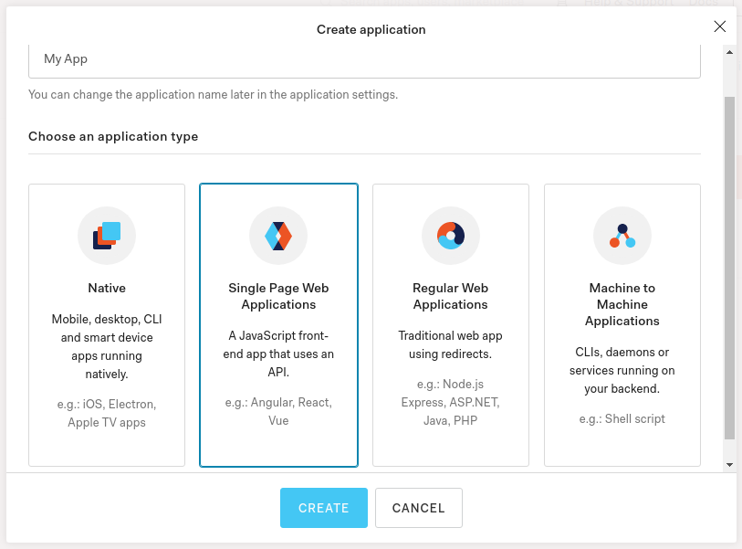
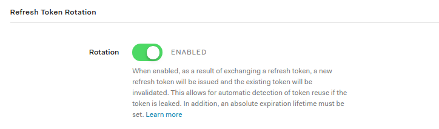
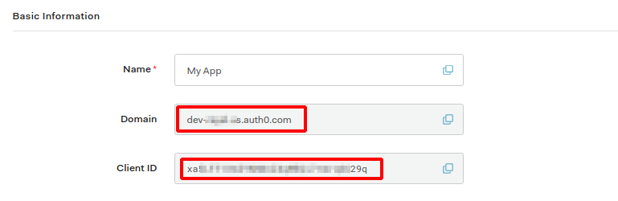
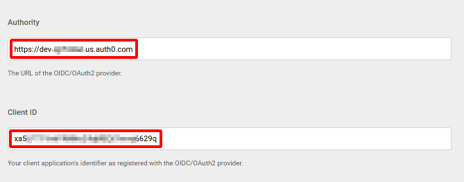
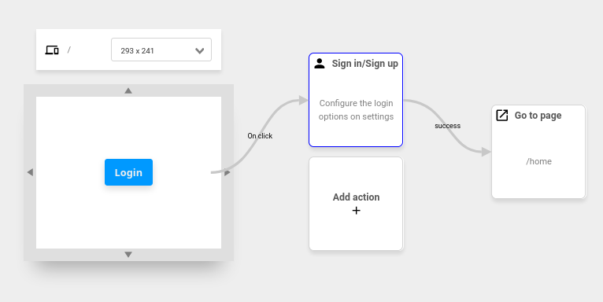
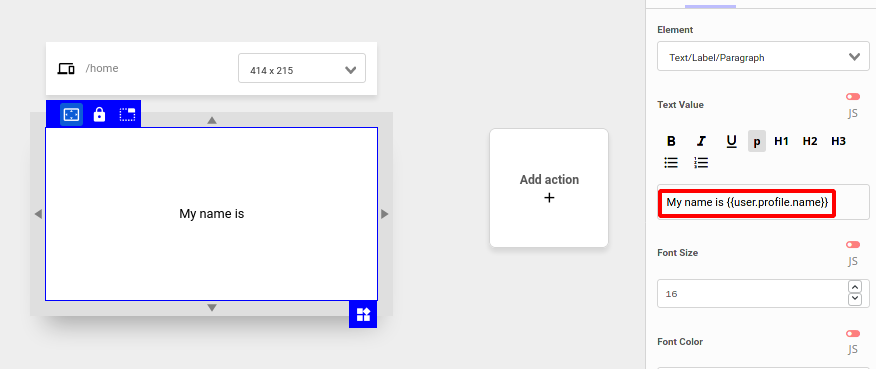
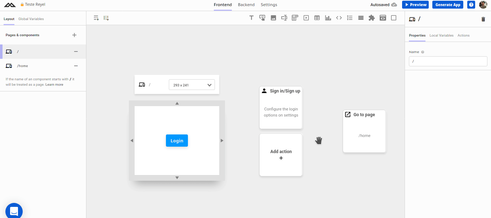

# Authentication with Auth0

In this tutorial we will show you how to integrate [Auth0](https://auth0.com/) with Abstra to enable in app [authentication](../../../../docs/projects/settings/authentication.md) with the [Sign-in](../../../../docs/projects/front-end/actions/login.md) and [Sign-out](../../../../docs/projects/front-end/actions/logout.md) actions.

## Auth0 Settings

After you create your account you will be presented with a dashboard.

Go to the `Applications` menu.  
   

Create a new application of the `Single Page Web Application` type.  
   

Go to the `Settings` tab and scroll down to the `Application URIs` section. In the `Allowed Callback URLs` paste `https://*.abstra.app/sign-in` and in the `Allowed Logout URLs` paste `https://*.abstra.app/sign-out`  
   

Scroll down to the `Refresh Token Rotation` section and make sure the `Rotation` toggle is enabled  
   

Scroll up to the `Basic Information` section and take note of the `Domain` and `Client ID` values  
   

## Abstra Settings

Access your project and go to the `Settings` page.

Go to the `Authentication` tab.  
Paste the `Domain` in the `Authority` field prepended with the `https://` protocol.  
Paste the `Client ID` in the respective field.  
   

And that's it, now you can use the [Sign-in](../../../../docs/projects/front-end/actions/login.md) and [Sign-out](../../../../docs/projects/front-end/actions/logout.md) actions.  

## Example

In this example we will implement a login button and display the logged user name.  
We have a two pages:  

The first has a `Button`, an `Sign-in` action when it is clicked and a `Go To Page` for the second page if the sign-in was successful.  

The second has a `Text` with [Mustache Notation](../../docs/projects/front-end/arguments/mustache-notation.md) and the `Text Value` is `My name is {{ user.profile.name }}`.  

This is the result.  
