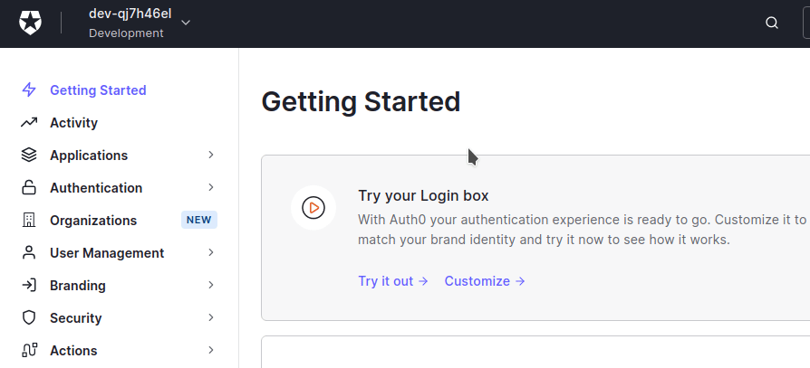
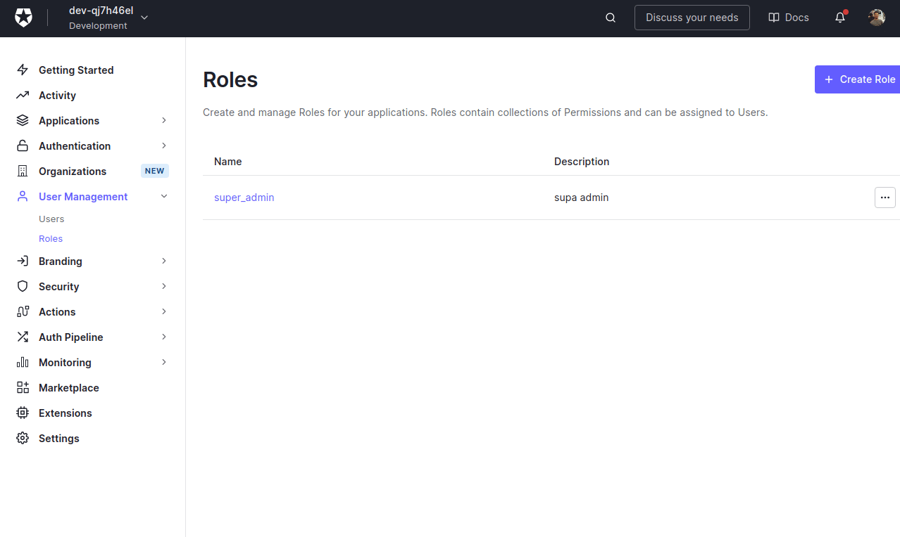
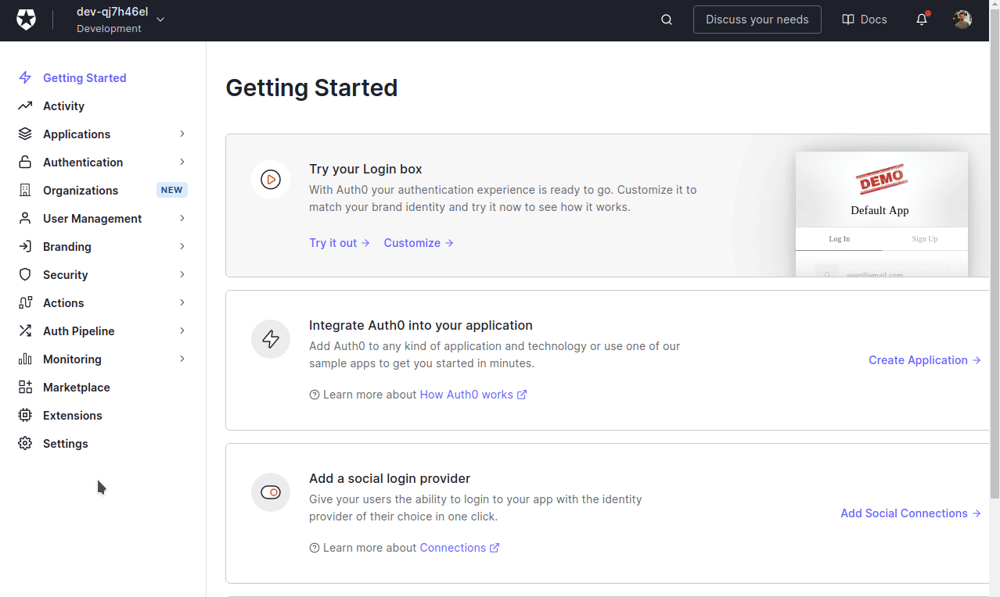
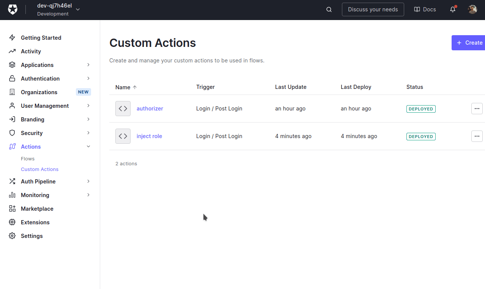
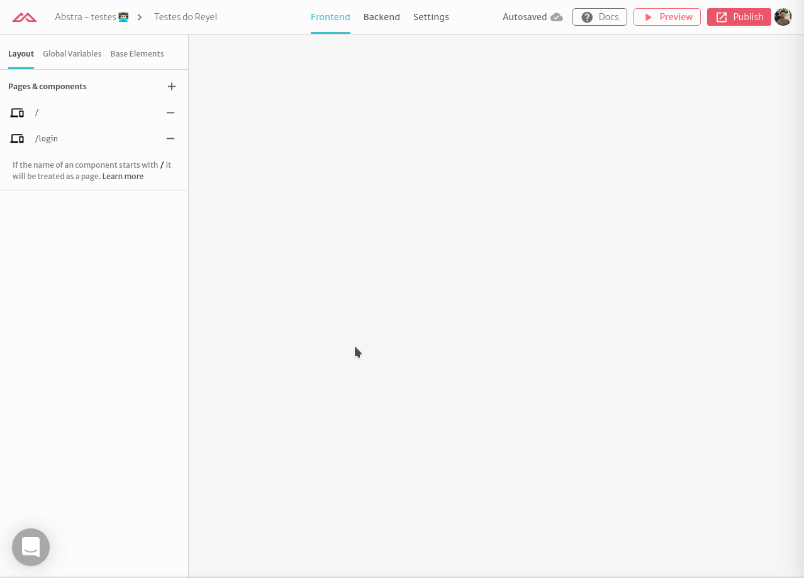
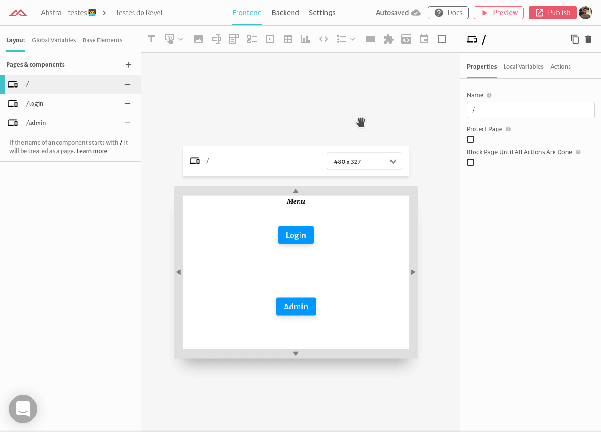
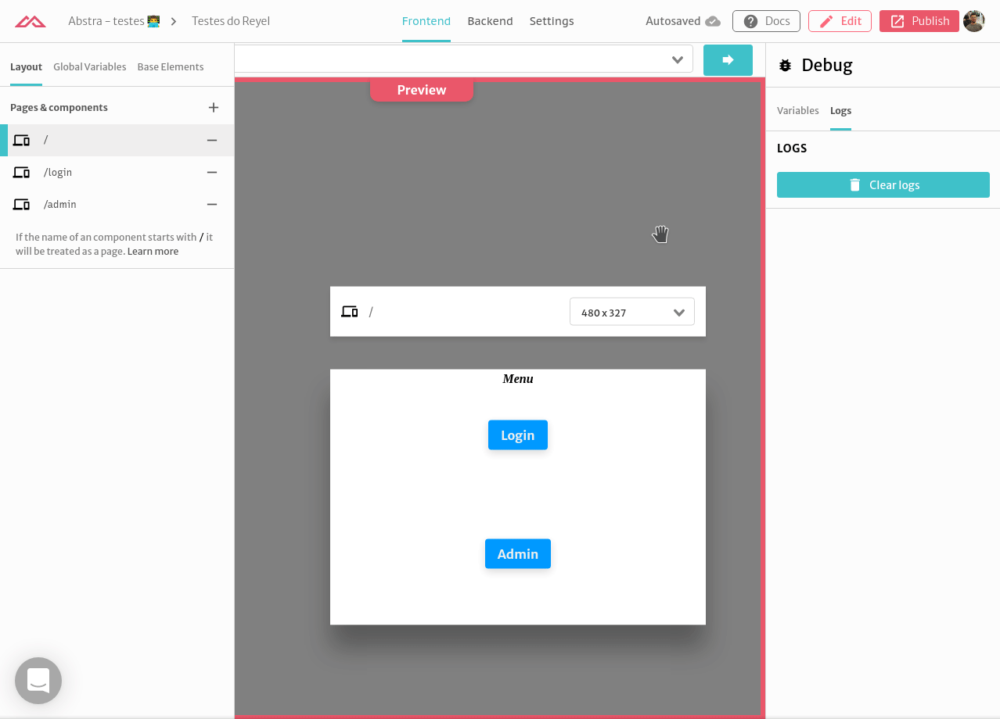

# Integrating with Auth0 Roles

In this tutorial we will show you how to use [Auth0](https://auth0.com/) roles with Abstra to enable in app [authentication](../../docs/project-settings/authentication.md) and permissions. We assume you have configured Auth0 credentials in your project \(see more [here](auth-with-auth0.md)\) 

## Configuring Auth0

Auth0 natively support roles but they don't inject this information by default in the **id\_token** claims. 

### Create Users and Roles

First check that you have users. In your dashboard go to **User Management** &gt; **Users** and check.



Now create your role in **User Management** &gt; **Roles** with name and description. Assign the role to a user.



### Create Actions to inject the roles

Now you need to create an custom action to inject the role in the **id\_token** claims. Go to **Actions** &gt; **Custom Actions** and create a new action. Choose the **name** and select the trigger as **Login / Post Login**. Fill the code with

```javascript
exports.onExecutePostLogin = async (event, api) => {
  const namespace = 'https://example.com';
  if (event.authorization) {
    api.idToken.setCustomClaim(`${namespace}/roles`, event.authorization.roles);
    api.accessToken.setCustomClaim(`${namespace}/roles`, event.authorization.roles);
  }
};
```

 and deploy your action. Note that as states in the [docs](https://auth0.com/docs/actions/triggers/post-login#add-user-roles-to-tokens), the **claim** must be an URI.



The last step is to add the new action to the respective flow. Go to **Actions** &gt; **Flows**, select **Login**, drag the action to the flow and **apply**.



You are done! Now you can test this with Abstra.

## Using roles in Abstra

Let's create a project with a protected page for `super-admin` users only. First go to your project and then **Settings** &gt; **Authentication**. Scroll down to **Try now** and check to see the roles you injected.


You can access your roles via `$.user.profile["https://example.com/roles"]`

Create a page called **/admin**. Create a _on page start_ trigger with **if...else...** action with the condition:

```text
$.user.profile["https://example.com/roles"].includes("super-admin")
```

In the **else** trigger create an action to go to the default page \(when user is no authorized\).



If someone enters this page without the role they will be redirected to the main page.



But if they enter with proper clearance, they can see the page.



