# Basic form

## Creating a basic form

In the Backend tab. Create the table where the data will be stored.

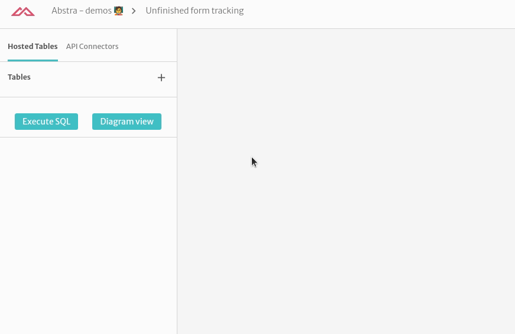

Add a `complete` flag where you know if there this form was sent

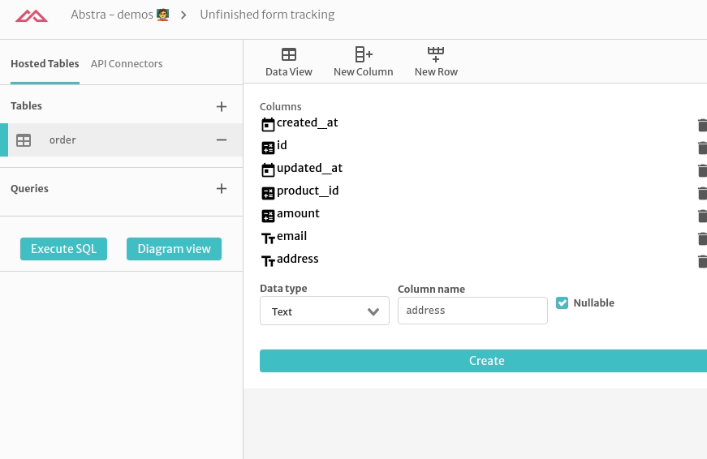

Adding the product table

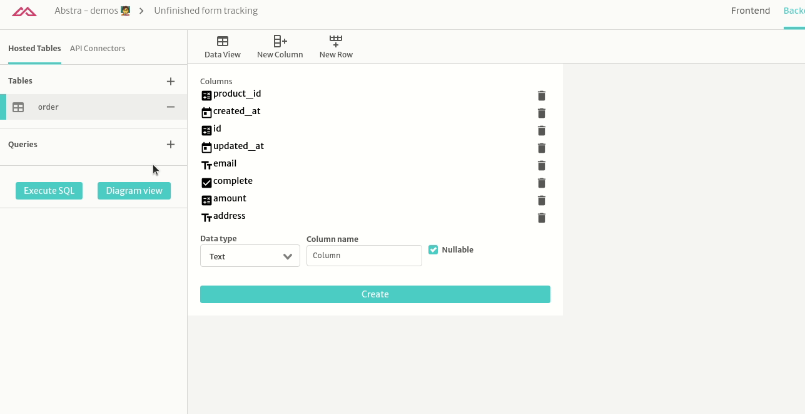

Adding some mock data for the products table

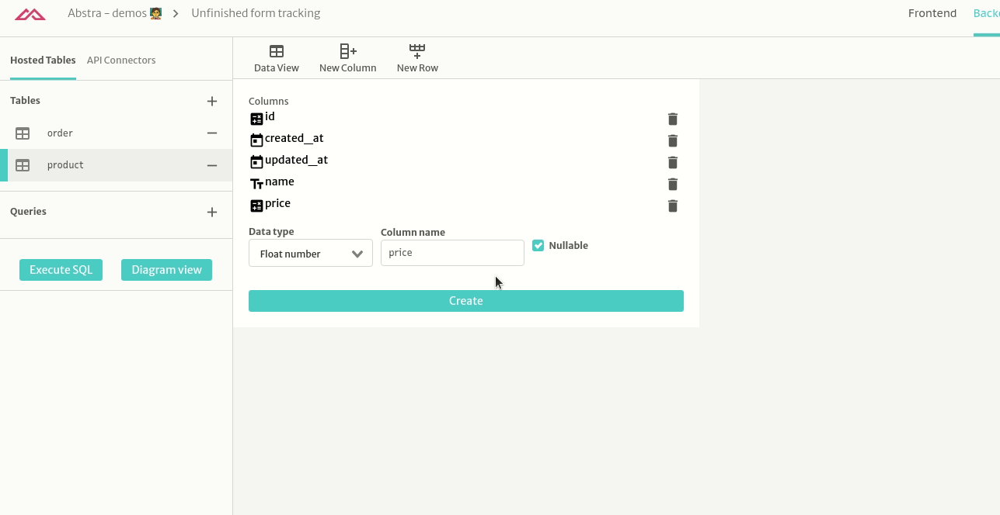

Create the product list query

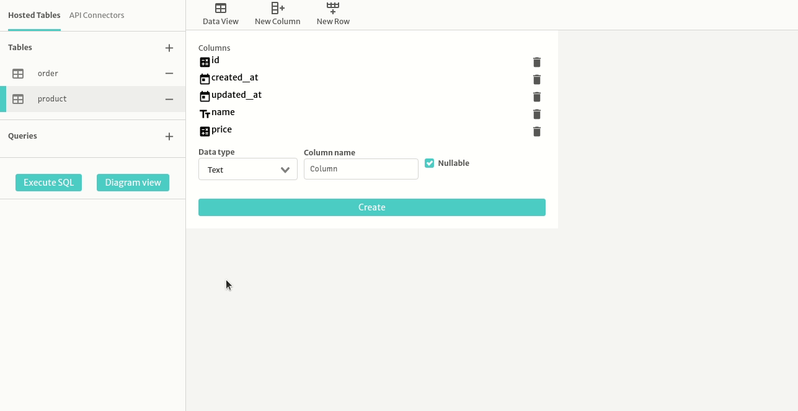

In the Frontend tab, create a variable to store the form data

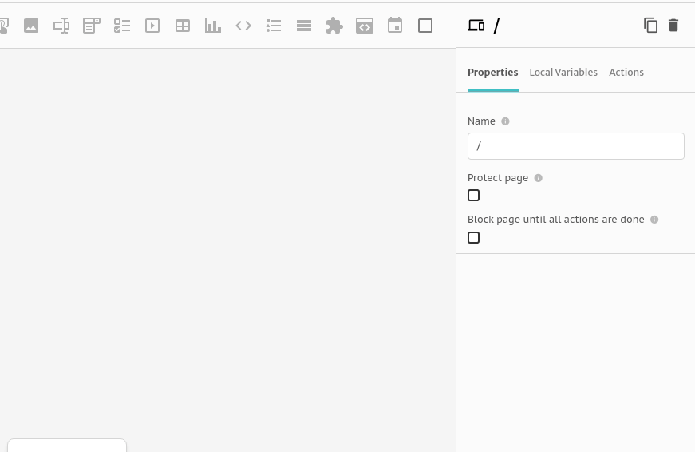

Add the inputs

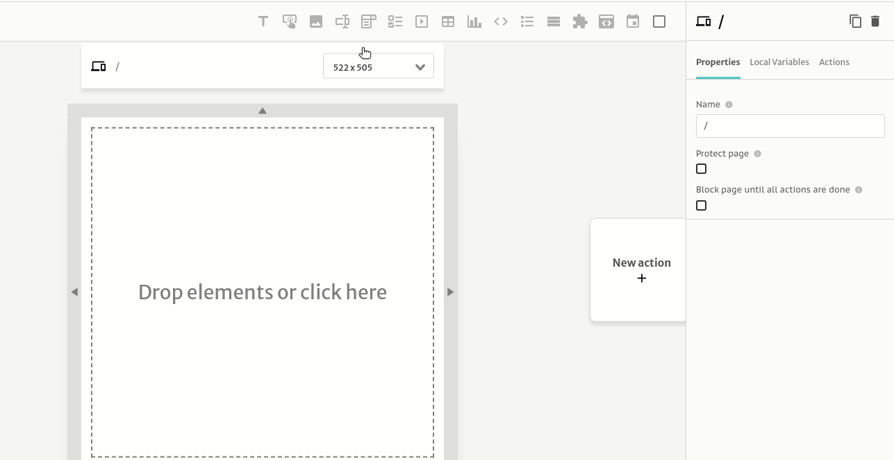

Link each input to the variable

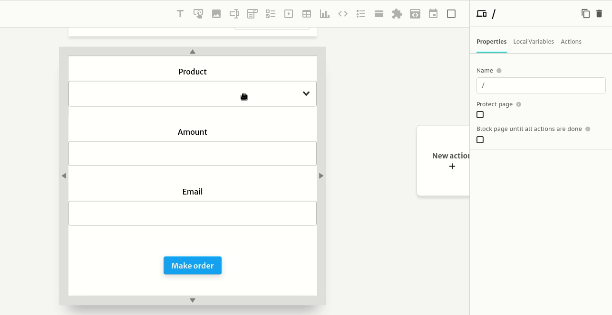

## Creating the order -&gt; product relashionship

Add the relationship column

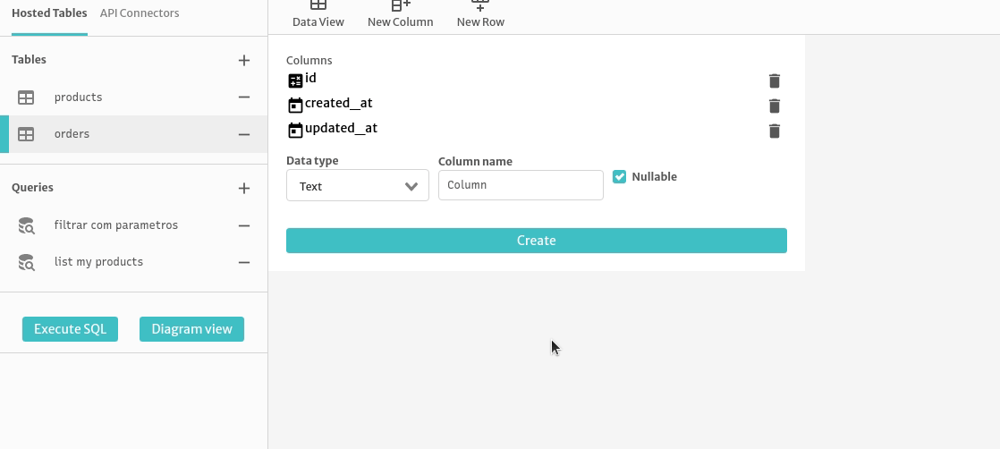

Create a variable to store the options

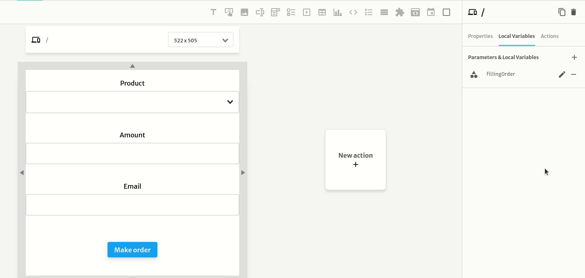

Get the list of products on page start

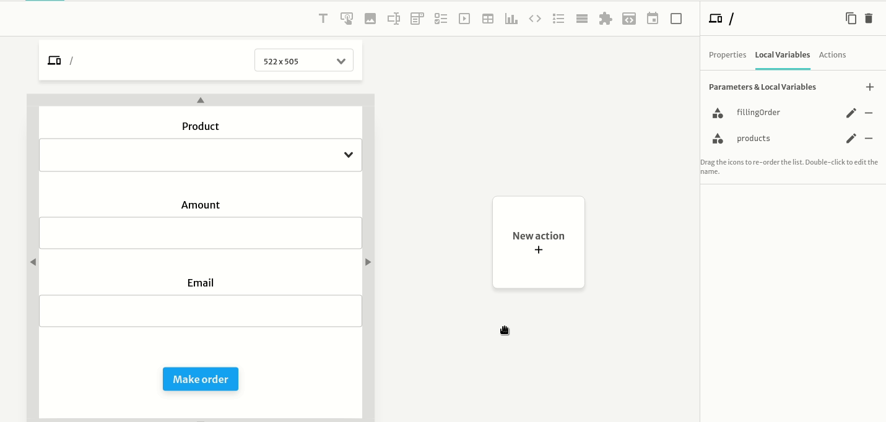

Link this list to the dropdown maping the list of product to the [options structure](https://docs.abstra.app/docs/projects/front-end/arguments/argument-types#options)

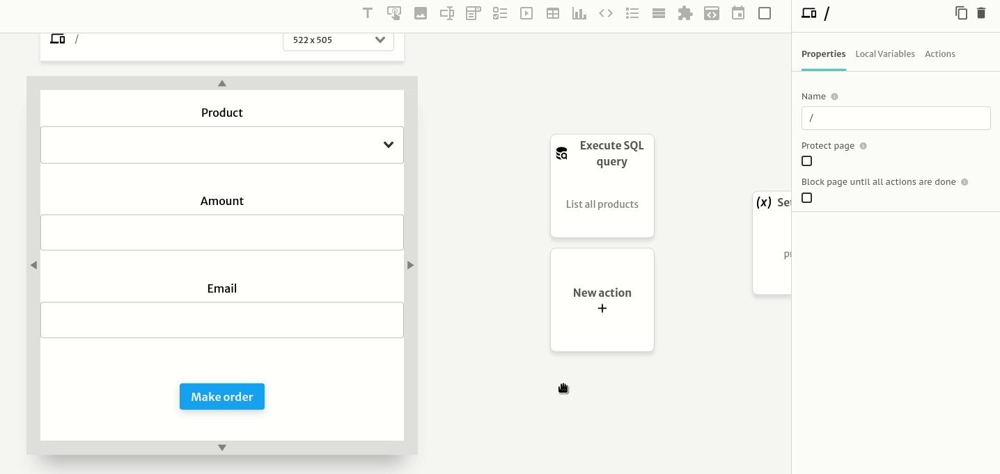

Code of mapping:

```javascript
$.products.map(p => ({value: p.id, label: p.name}))
```

To check if is everything alright, test it in the preview mode

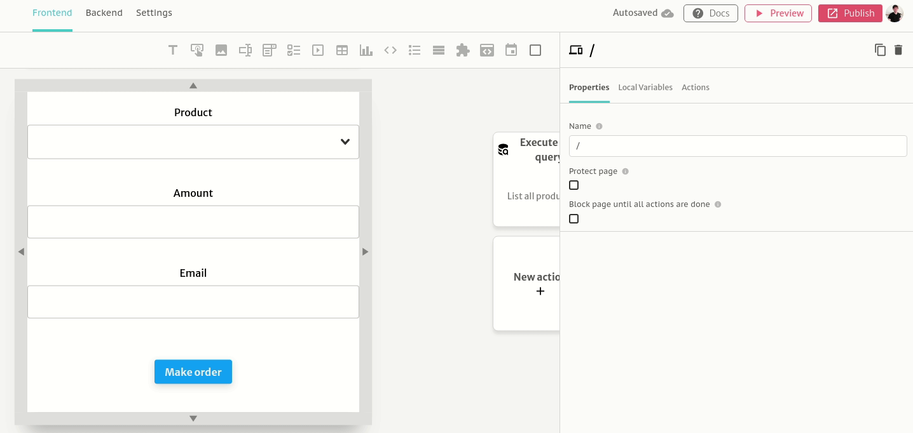

Create the query to insert the data in the database

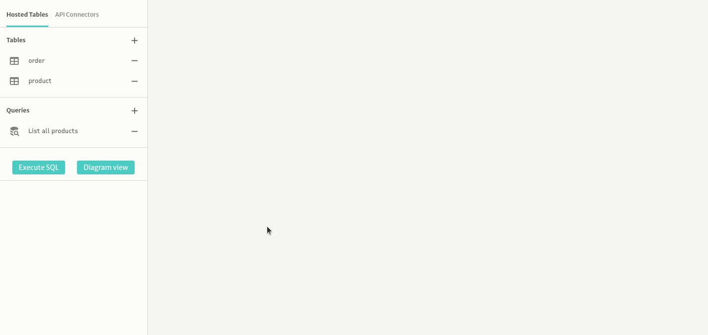

Code of query:

```sql
insert into "order"
(email, amount, product_id)
select
email, amount, product_id
from json_populate_record(null::"order", $1)
```

To fininish, let's add the button action

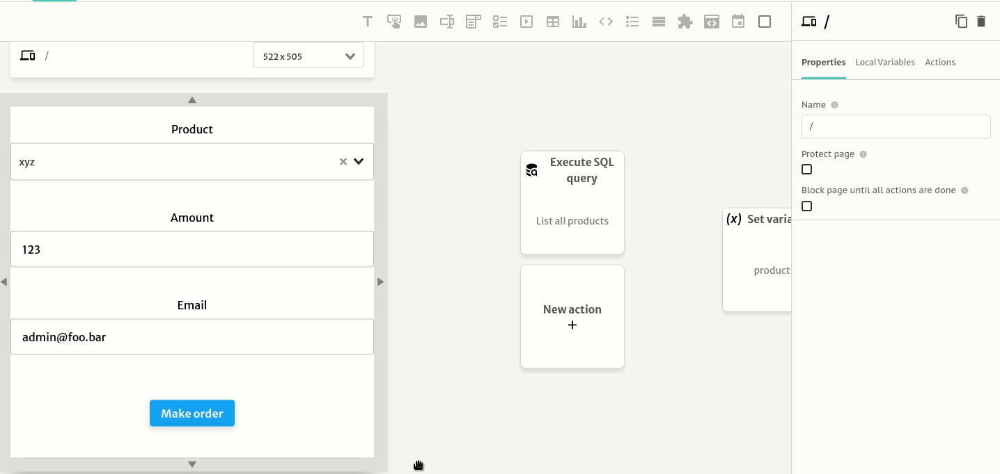


