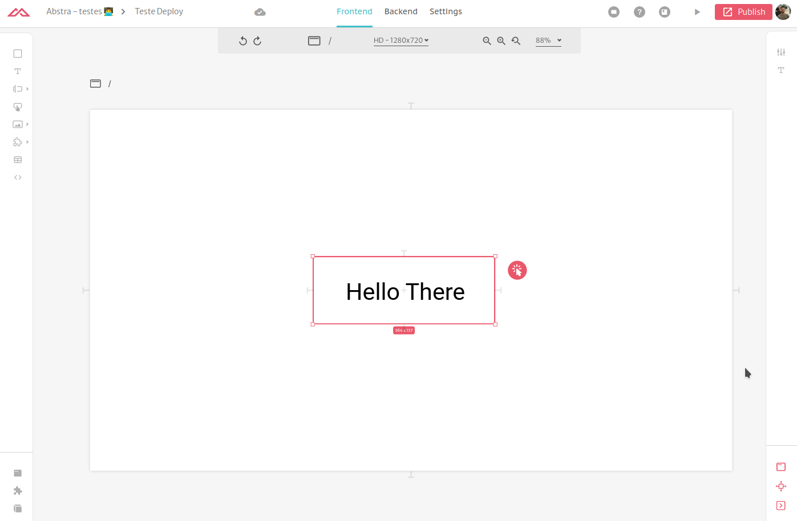
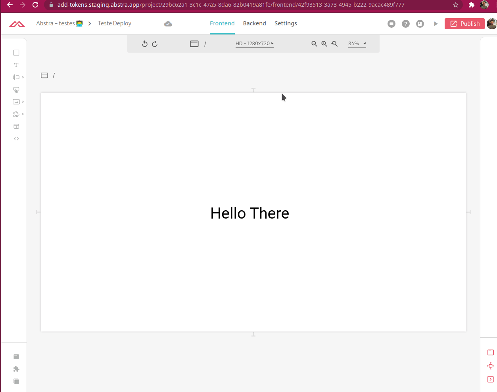
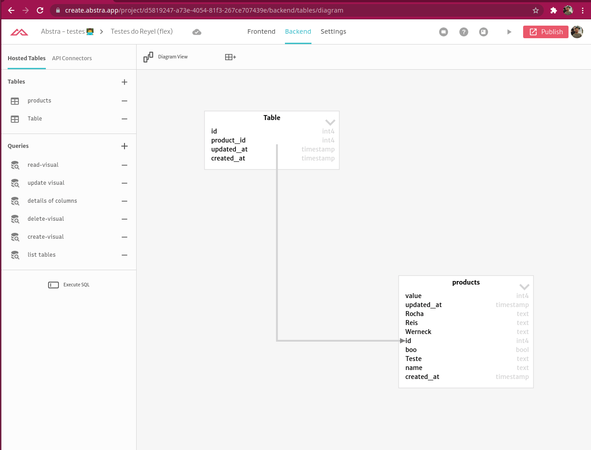

# Calling Connectors or Tables from outside Abstra

In this tutorial you will learn how to call/use methods and queries from outside Abstra.

## Generating API Token

If your method or query is not protected you can skip this step.

Abstra uses by default the tokens of the logged user to authenticate protected methods or queries. But if you are programmatically accessing then there user is no user.

Instead you need to go to your project and click in `Setting`  &gt; `Authentication` and scroll down to the `Manage your tokens` section. There you can create and delete tokens. 


Be aware. If you delete a token that another automation is using, it will lose access to the resources




## Execute a Connector Method

To call a method you need at least the `method id` and the `connector type`



To execute it all you have to do is a POST request on:

```text
https://remote-actions.services.abstra.app/v2/execute/<CONNECTOR-TYPE>
```

The body should be JSON-encoded and follow the template:

```javascript
{
    "props": {
        "id": <METHOD-ID>,
        "args": <ARGS>
    }
}
```

If the connector is protected you need to pass the following header with the bearer token:

```javascript
"Api-Authorization" : "Bearer <API-TOKEN>"
```

### About connector type

The following is the mapping of connector types that can be called from outside Abstra

* Airtable: `airtable`
* DynamoDb: `dynamodb`
* Email: `email`
* MongoDb: `mongodb`
* MySQL: `mysql`
* Postgres: `postgres`
* SQLServer: `sqlserver`
* SSH: `ssh`

### About ARGS

The ARGS value is what the method expects to run.

#### Key Value Dictionary

For the following Connectors, the value of ARGS is a key:value dictionary/object with the keys specified in the methods and their values

For **Airtable**, **Email**, **MongoDb** and **SQLServer**, the key is a word preceded the the dollar sign `$`.  
Example: The following e-mail method specified the parameters `$amount` and `$price`


So the body should look like this:

```javascript
{
    "props": {
        "id": <METHOD-ID>,
        "args": {
            "$amount": 123,
            "$price": "USD 1.5"
        }
    }
}
```

For **DynamoDb** and **SSH** is the same but the keys start with the colon `:`

#### List

With Postgres Connector you specify numeric parameters \(`$1`, `$2`, etc...\), so your ARGS value will be a list ordered by the number. Example: The following query requires two parameters `$1` and `$2`


So the body should look like this:

```javascript
{
    "props": {
        "id": <METHOD-ID>,
        "args": [
            123123123123,
            "% reyel %"
        ]
    }
}
```

## Execute a Tables Query

To call a query you need at least the `statement id` 




To execute it all you have to do is a POST request on:

```text
https://tables.services.abstra.app/graphql
```

The body should be JSON-encoded and follow the template:

```javascript
{
    "query": "mutation ExecuteStatement($statementId: ID!, $args: [Arg]) { execute_statement(statement_id: $statementId, args: $args) { rows } }",
    "variables": {
        "statementId": <STATEMENT-ID>,
        "args": <ARGS>
    }
}
```

If the query is protected you need to pass the following header with the bearer token:

```javascript
"Api-Authorization" : "Bearer <API-TOKEN>"
```

### About ARGS

#### SQL Queries

With SQL queries you specify numeric parameters \(`$1`, `$2`, etc...\) so your ARGS value will be a list ordered by the number. 

Example: The following query requires two parameters `$1` and `$2`


So the body should look like this:

```javascript
{
    "query": "mutation ExecuteStatement($statementId: ID!, $args: [Arg]) { execute_statement(statement_id: $statementId, args: $args) { rows } }",
    "variables": {
        "statementId": <STATEMENT-ID>,
        "args": [
            123123123123,
            "% reyel %"
        ]
    }
}
```

#### Visual Queries

With Visual queries you specify filter and write parameters \(`write.name`, `filter.id`, etc...\) so your ARGS value will be a list with dictionaries/objects containing `param` and `value` keys. 

Example: The following query requires two parameters `write.name` and `filter.id`


So the body should look like this:

```javascript
{
    "query": "mutation ExecuteStatement($statementId: ID!, $args: [Arg]) { execute_statement(statement_id: $statementId, args: $args) { rows } }",
    "variables": {
        "statementId": <STATEMENT-ID>,
        "args": [
            {
                "param": "write.name",
                "value": "Joao"
            },
            {
                "param": "filter.id",
                "value": 1231
            }
        ]
    }
}
```

