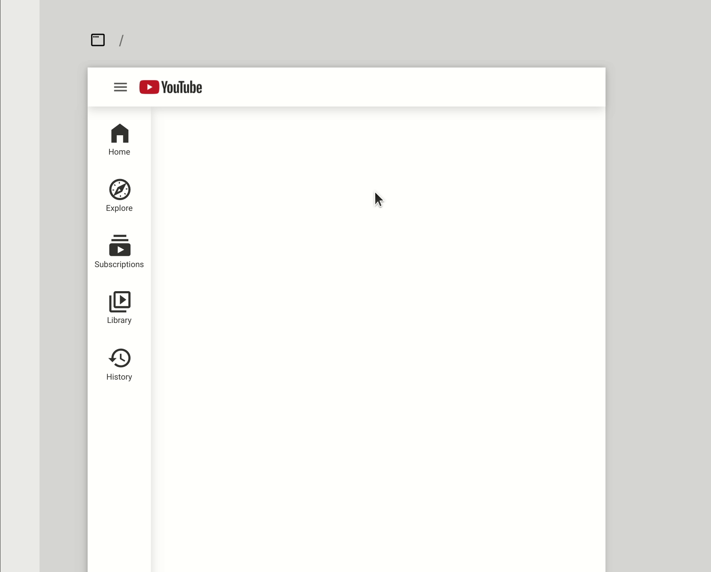
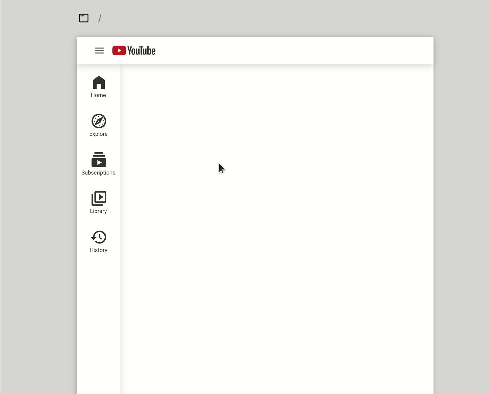

# Collapsible sidebar

[Example](https://create.abstra.app/template/2b3ddcf3-770f-483b-ab0c-c99c3f67b3bf)

First, lets create the two versions of our sidebar (collapsed and expanded).

 (1).png>)

Now we can transform each version into one component.

 (1).png>)


Notice that no distances to the right of the page are fixed. This is important because the sidebar is aligned to the left.


Now you have both components, you can add a click event on the hamburger menu icon to show the expanded version of the sidebar.

 (1) (1).png>)

Now you should have a working sidebar like that:

Notice that the expanded sidebar is shown glued to the top. You can fix that by making an offset on the expanded sidebar with the same size as your navbar

 (1).png>)

