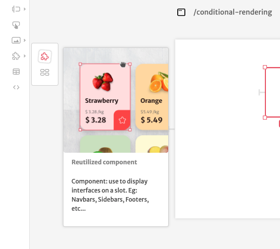
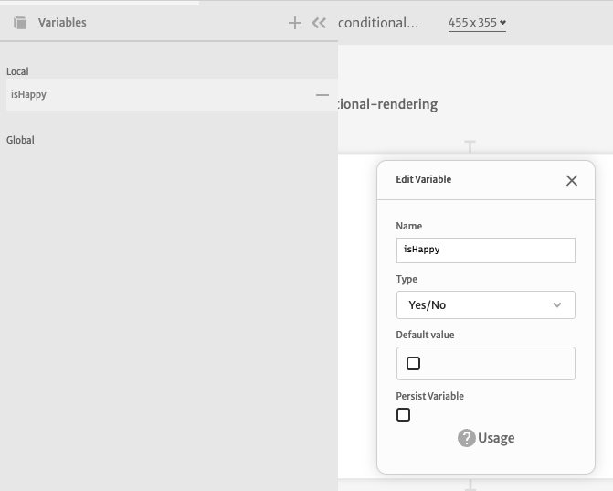
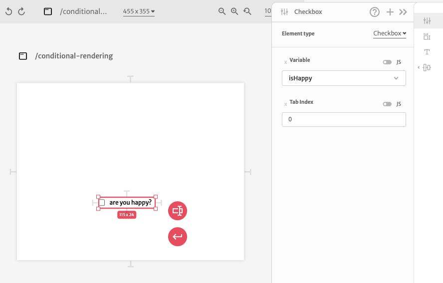
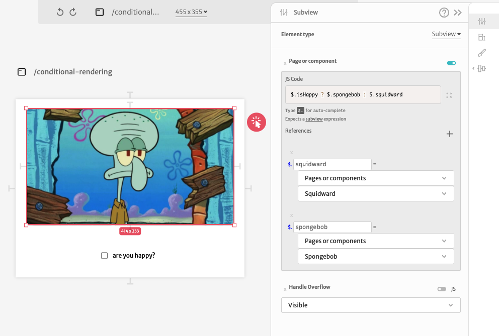

# Conditional rendering

You can use subviews to conditionally render components in your application. Add a [Reutilized Component](../../docs/front-end/elements/subview.md) to your page.

In this example we are going to use a `isHappy` variable to conditionally render some component.

Then we can bind this variable to a [Checkbox Input](../../docs/front-end/elements/inputs/checkbox.md)  just to toggle our variable and test our conditional render.

Now we can toggle our [Reutilized Component](../../docs/front-end/elements/subview.md) based on this variable value. We just have to bind our components to some reference and add a ternary expression in your [JS mode](../../docs/front-end/arguments/expression-mode.md) to choose between our references based on the `isHappy` variable value.

Working example:

