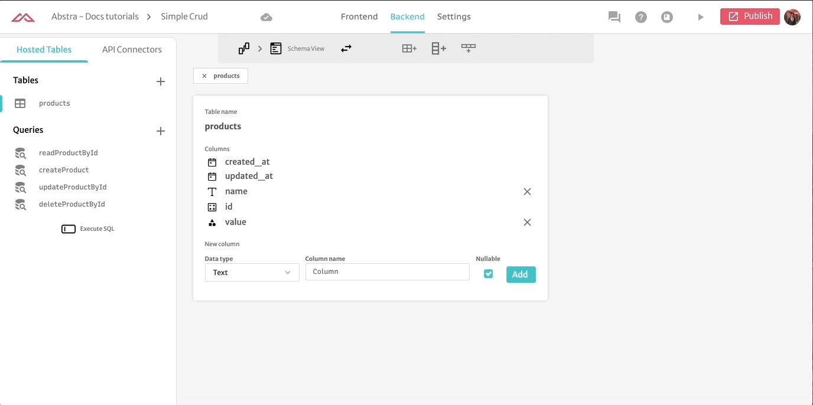

# Creating a Read and Update app

First and foremost, we should create our products page with a table element where we can see all our registered products.

In order to do that, we will need to create a simple table, products, with a query to read all our elements registered in it.

Notice that we also have the rest of the CRUD queries created as well.

Now we can go back to the Frontend and configure our table element to be populated with our products table and set an action of `rowClick` in order to go to the `product` page.

Now that our action is partially configured, we should configure our route to the `product` page. It should receive a route param indicating the `productId.`

Now everything is set and whenever we click in a row it will lead to the specific product page with its id in the route params.\
All that is left for us to do is to create a simple form for the product.

First we load the product utilizing its `id`, located on the route, on the action `On Page Start`.

.gif>)

Then we create a local variable called product and populate it with our action `set Variable`

Now that our variable already has the value it should have, we can drag the elements into the view and configure them.

This input will edit the value within `product.name` for us. So we can utilize that local value to edit our database value through the edit query attached to a button.

And we're done. Our simple read and edit app is ready :)\
Notice that to create and delete is as simple as what we did here just need to adjust the query accordingly.

