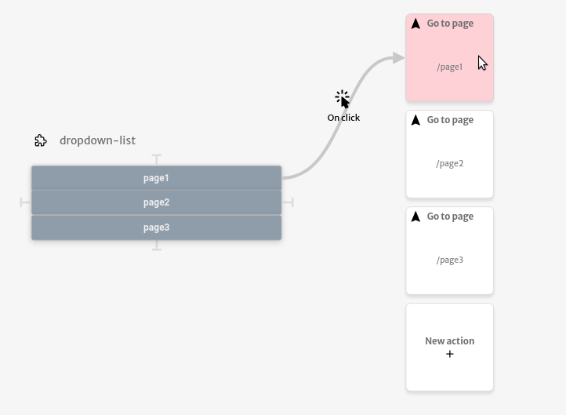
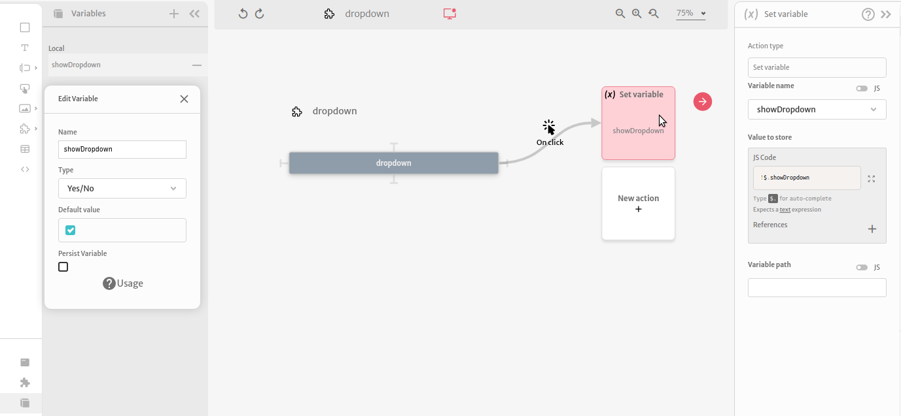
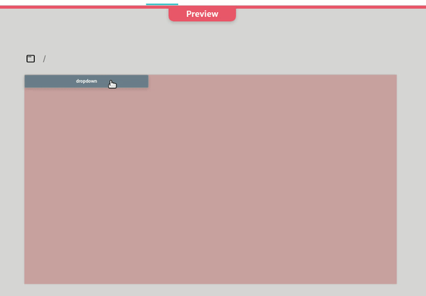

# Dropdown Menu

In this tutorial you will learn how to create a dropdown menu using subview. First create a component with the dropdown actions list

Then create another component wich will be the dropdown menu component. This component will have the main button, that will open and close the dropdown list, a local variable called showDropdown and an action to set this variable that will simulate the toggle of the button. Note that this variable should receive its opposite value.

Now you need to add the dropdown-list as a component, but this component will only be shown when the showDropdown variable is checked.

.png>)

Finally you can add the dropdown menu component on any page.

