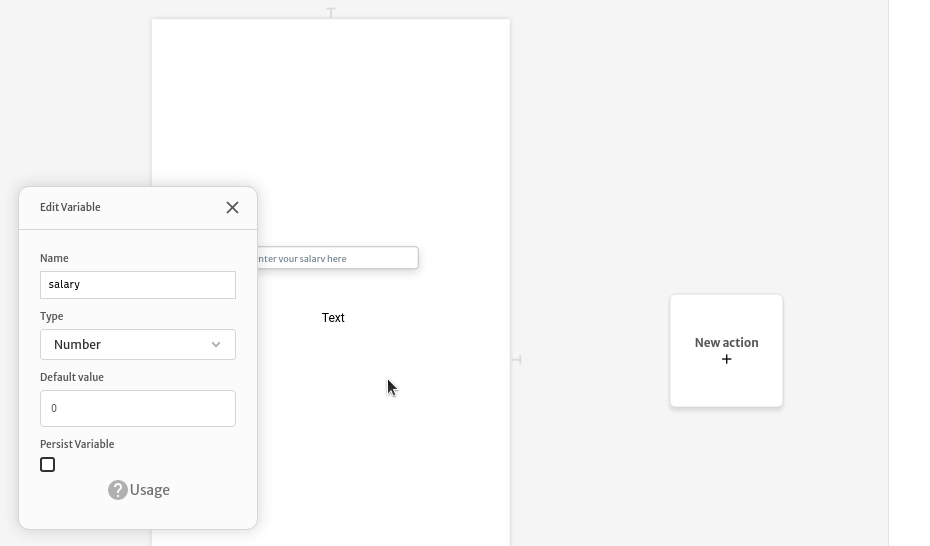

# Formating numbers

## Decimal places

If you need set a fixed number of decimal places, you can toggle JS mode and then usd `.toFixed` method from Javascript.


The variable/data type should be `number`, otherwise the method `toFixed` will not be available.




### Using commas or other formats

Once you are in Javascript mode, you can always replace characters, like that:

```text
$.salary.toFixed(2).replace(/\./g, ',')
```

