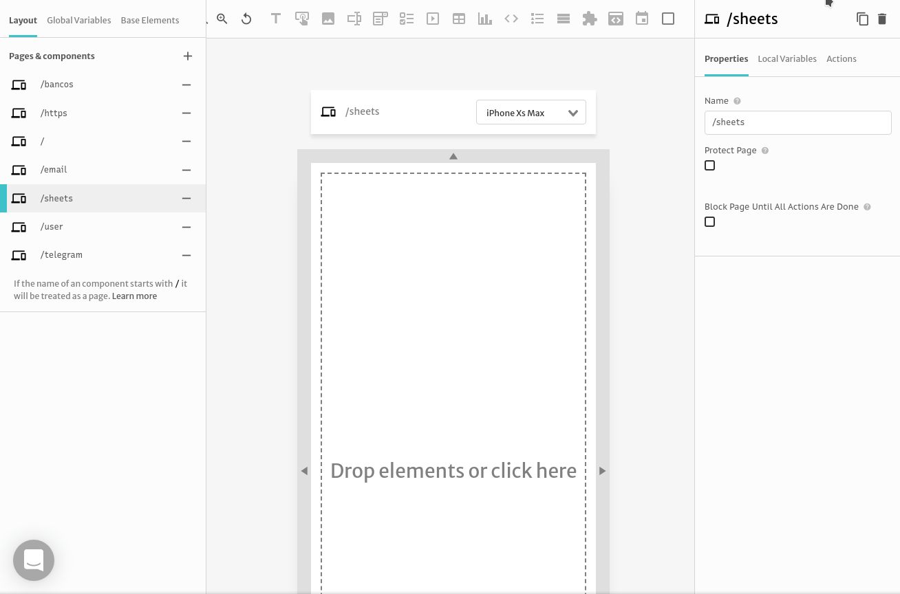

# Connecting with Google Sheets

In this tutorial we will show you how to integrate [Sheets API](https://developers.google.com/sheets/api/guides/concepts) data using the [values.get](https://developers.google.com/sheets/api/reference/rest/v4/spreadsheets.values/get) method with Abstra and display them in a [table]() or [list]().

## Google Sheets API

In order to fetch data from Google Sheets you need 3 things:

* **spreadsheetId**: Can be found in the sheet URL between "d" and "edit"`https://docs.google.com/spreadsheets/d/spreadsheetId/edit`. For example if the URL of the sheet is `https://docs.google.com/spreadsheets/d/abcdefgh/edit` then the **spreadsheetId** is _abcdefgh._ [Reference](https://developers.google.com/sheets/api/guides/concepts#spreadsheet_id).
* **range**: Is the range of cells you want to fetch. It uses the [A1 notation](https://developers.google.com/sheets/api/guides/concepts#a1_notation). For example if you want all cells in a sheet called Sheet1 then the **range** is the sheet name _Sheet1_.
* **token**: Google sheets need authorization to access data. For more information see [Acquiring API Key](https://developers.google.com/sheets/api/guides/authorizing#APIKey)

After you have all the information above you can check and see if they are working as expected. Go to a browser and type `https://sheets.googleapis.com/v4/spreadsheets/{{spreadsheetId}}/values/{{range}}?key={{token}}` replacing your info. You should see your sheet data in the following format:


## Configuring API Connectors

Now you need to configure the API with a Rest Connector. Go to **Backend** &gt; **API Connectors** and add a **Restful API**.


Choose the **name** and fill the **base URL** with  `https://sheets.googleapis.com/v4/spreadsheets/{{spreadsheetId}}` 


Create a new **request method**. Choose the **name** and fill the **URL Path** with `/values/{{range}}?key={{token}}` 


Now you can test and see the result


To format the output you can test and save in the **Json Path Tester the path** `$.values.*` 


And you are set!

## Display the data in a Table

If your data has a header like ours you can format it to show them in a table. On a new page create a variable **anything** called `tableData` 



Now to fill the variable `tableData`, create an **action** _on page start_ and call the API connector


To set the variable click on the success trigger, choose the **set variable** action, choose the variable `tableData` and set the value on the **expression mode** with:

```text
$.response.slice(1).map(row => 
    row.reduce((acc, curr, idx) => {
        return {...acc, [$.response[0][idx]]: curr}
    }, {})
)
```


Finally you can put a table in the page and set its data to `$.tableData` on the **expression mode**


You are done! Now you can preview your page before deploying your final application


 


