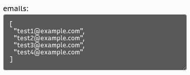
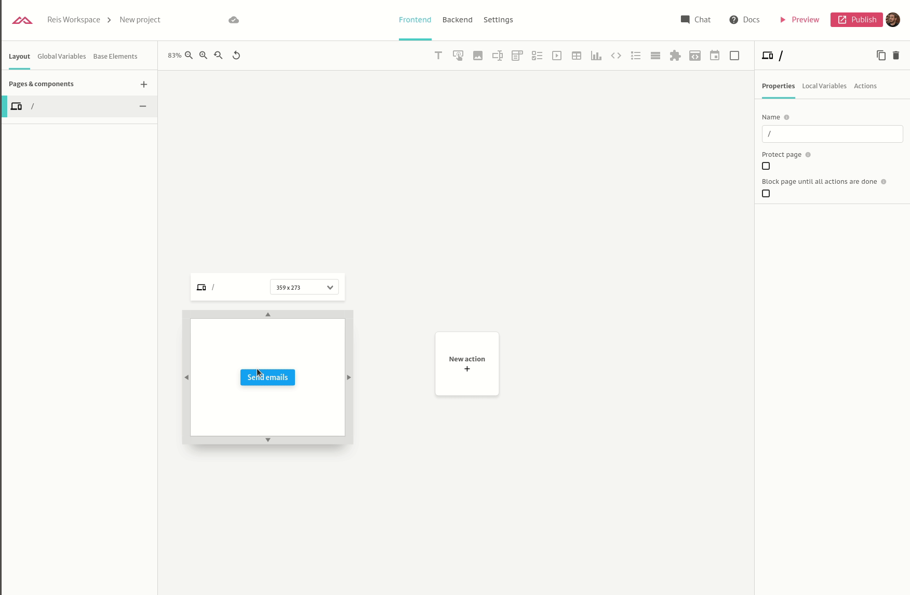

# Iterating over a variable

Using our `forEach` action you are able to iterate over a list and perform an action for each item of that list. Consider you have the following variable that contains a list of e-mails:

You can dispatch an action for each item of that list creating a `forEach` action:

This will execute the `welcomeMessage` method from `Email Provider` connector for each e-mail inside the emails list variable.

