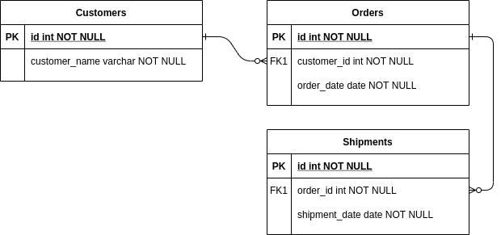
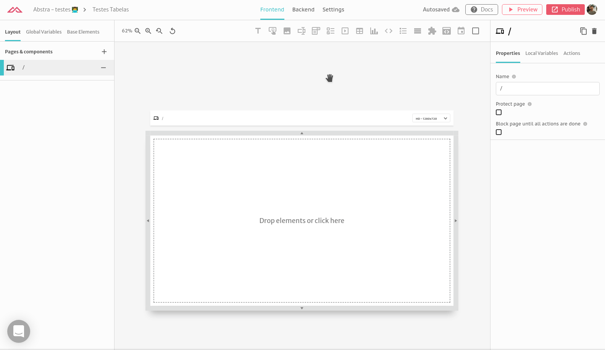
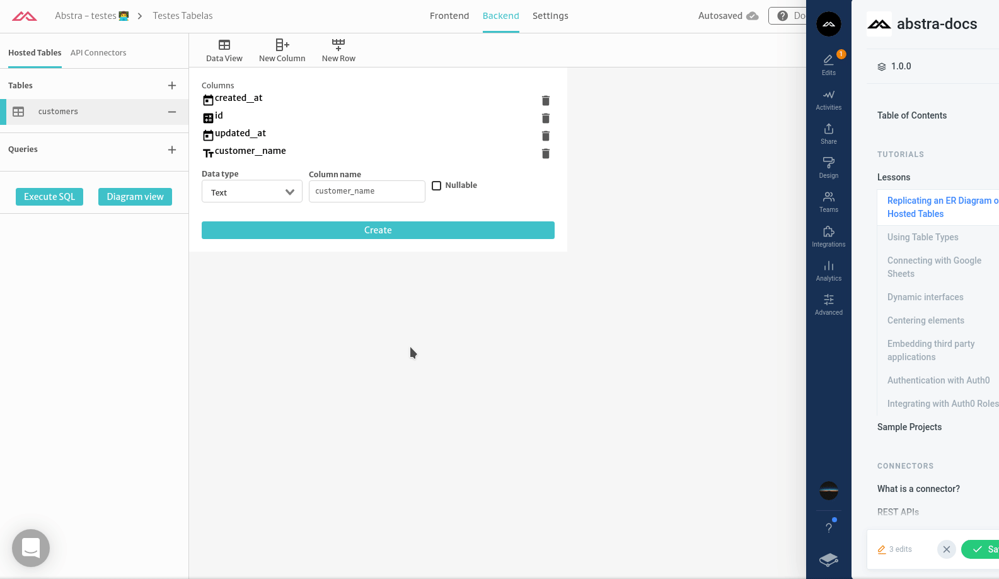
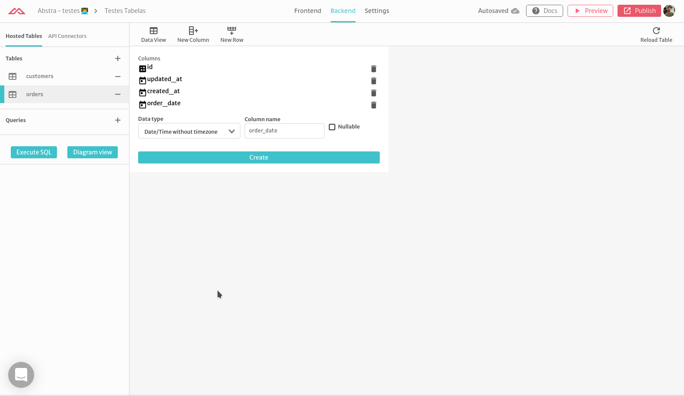
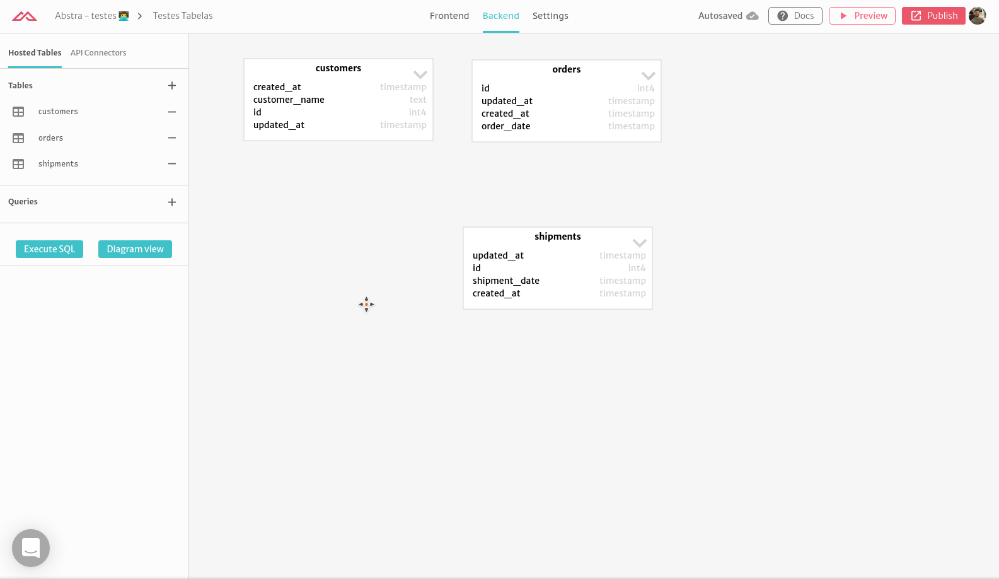
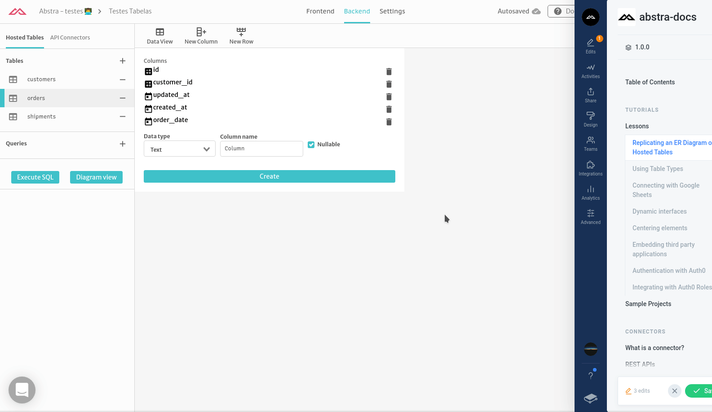
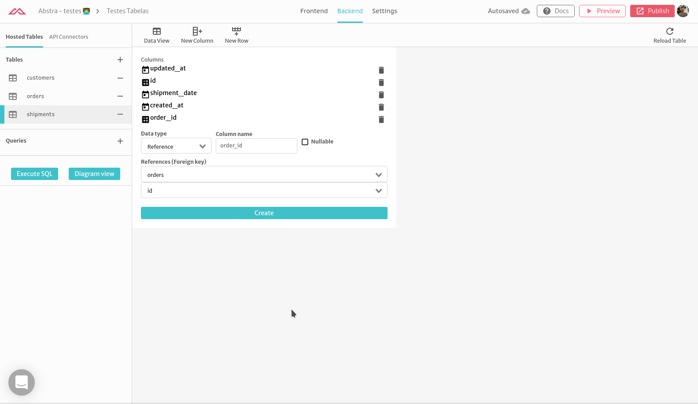

# Replicating an ER Diagram on Hosted Tables

In this tutorial we will show you how to create a database with foreign-key relationships with hosted tables based on the following ER diagram.

### Creating the tables

Creating tables with Abstra is easy. Just go to **Backend** > **Hosted Tables** and click on the add button. By default we create the columns **id **(int), **created_at** (timestamp without timezone) and **updated_at** (timestamp without timezone). This columns don't need to be filled when inserting or updating the database, they are automatically filled. After that you can create the columns for you table:

**Customers** (**customer_name** _varchar_ NOT NULL)

**Orders** (**order_date** _date_ NOT NULL)

**Shipments** (**shipment_date** _date_ NOT NULL)

After you finish you can see the diagram of your database:

### Creating the relations

In the ER diagram we have two relations:

* customer_id in Orders points to Customers
* order_is in Shipments points to Orders  

With Abstra creating relations is as easy as creating another column: select the date type **reference**, select the **table** and then the **column**.

**Orders** (**customer_id** _int_ NOT NULL)

**Shipments** (**order_id** _int_ NOT NULL)

You are done! Now you can see the diagram of your database and check for the relations:

