# Responsivity

## Default behavior

By default, any element will keep its size and position relative to the top-right corner of the view.

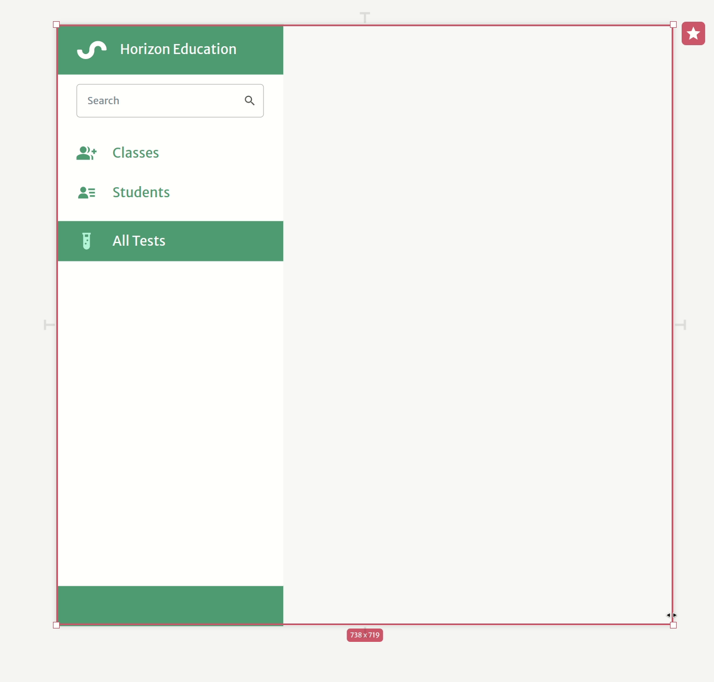

## Springs

In Abstra, you can fix distances on the interface using springs which allow you to set responsive behaviors on your elements.

### Adding springs

#### Hooks

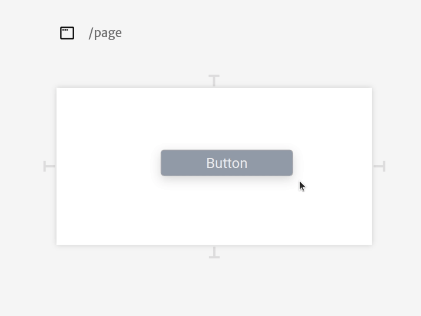

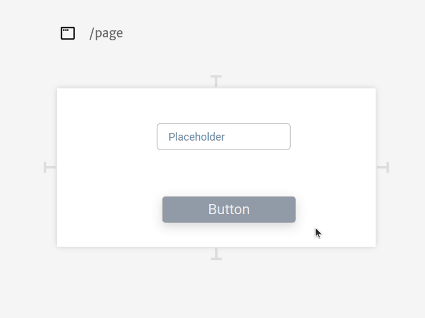

#### Spring shooter

Using the spring shooter in the responsivity inspector tab, you can add springs on the interface without having to manually drag and drop them.

.png>)

### Behavior

#### Fixing an element to the view

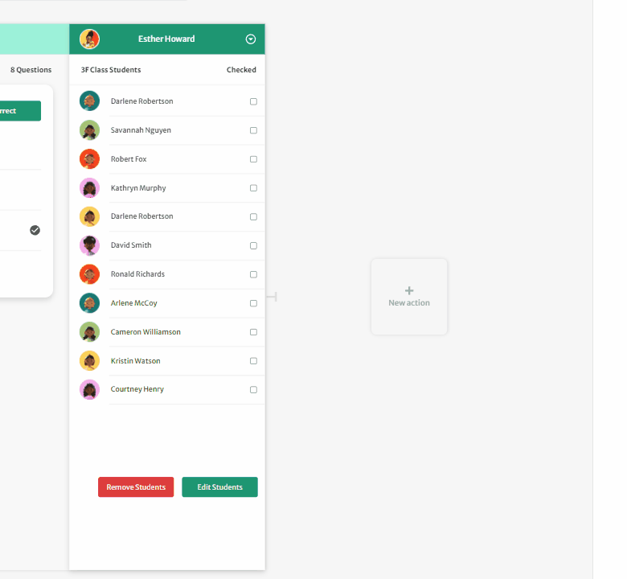

#### Chaining elements

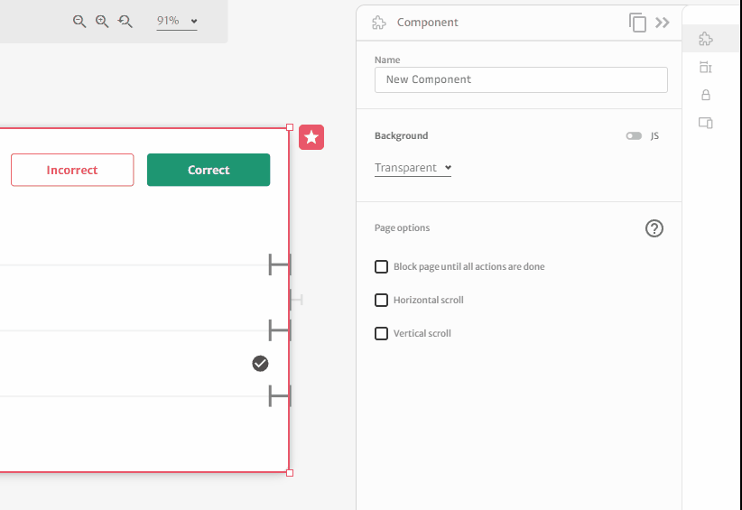

#### Fixing an element to both sides makes it stretch (when not fixed-width)

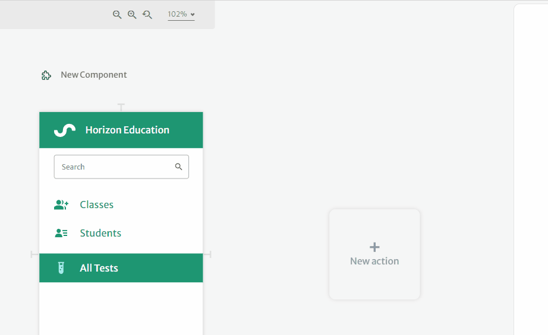

#### Fixing an element to both sides centers it (when fixed width)

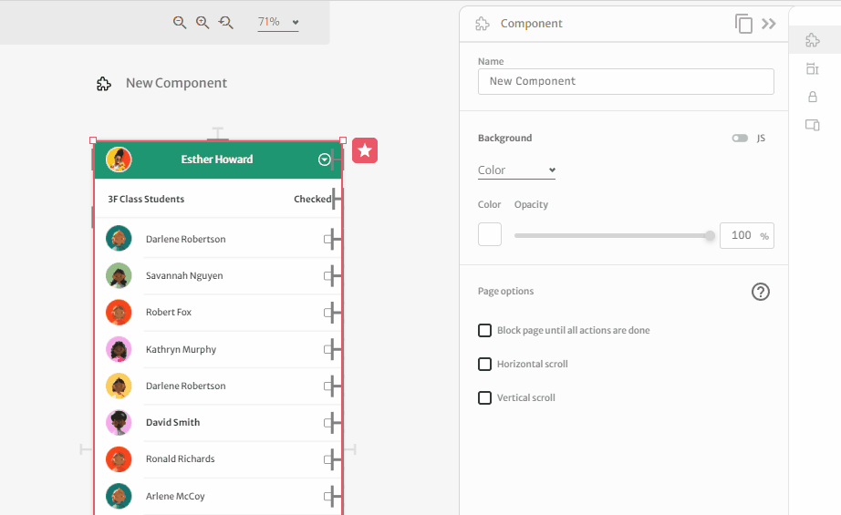

#### Two columns, both flexible

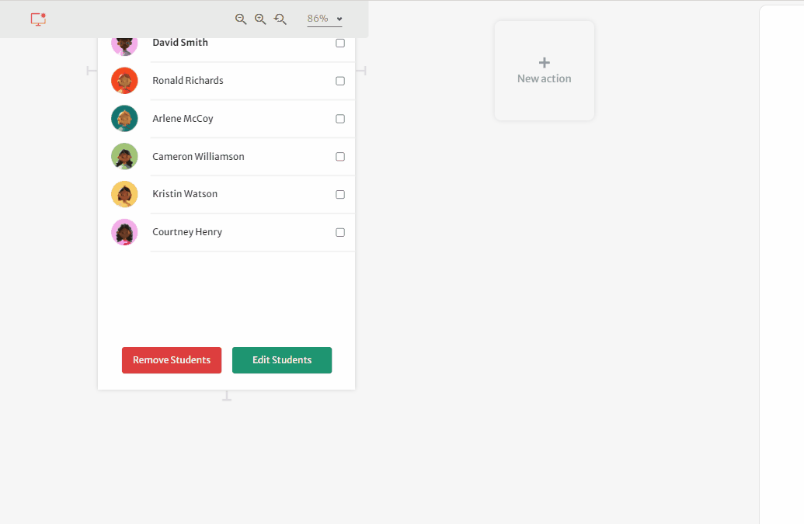

#### Two columns, both fixed

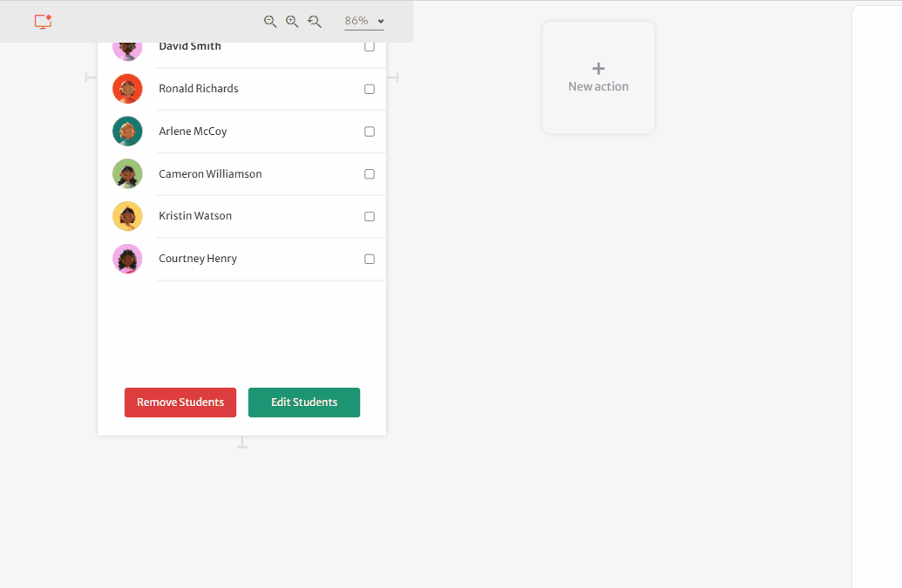

#### Two columns, one flexible, and one fixed

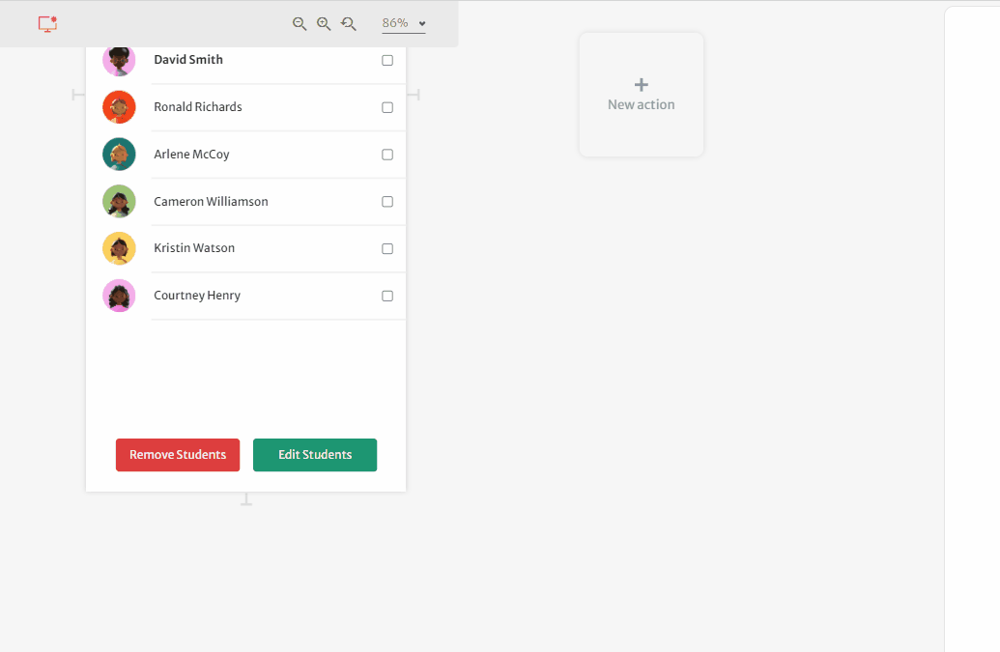

#### Components to make elements fixed amongst themselves

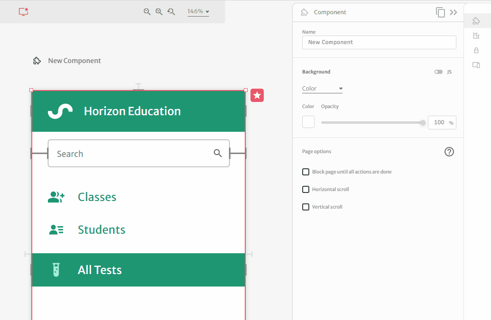

You can always combine springs and [breakpoints](../../docs/front-end/breakpoints.md) to make fully responsive apps

