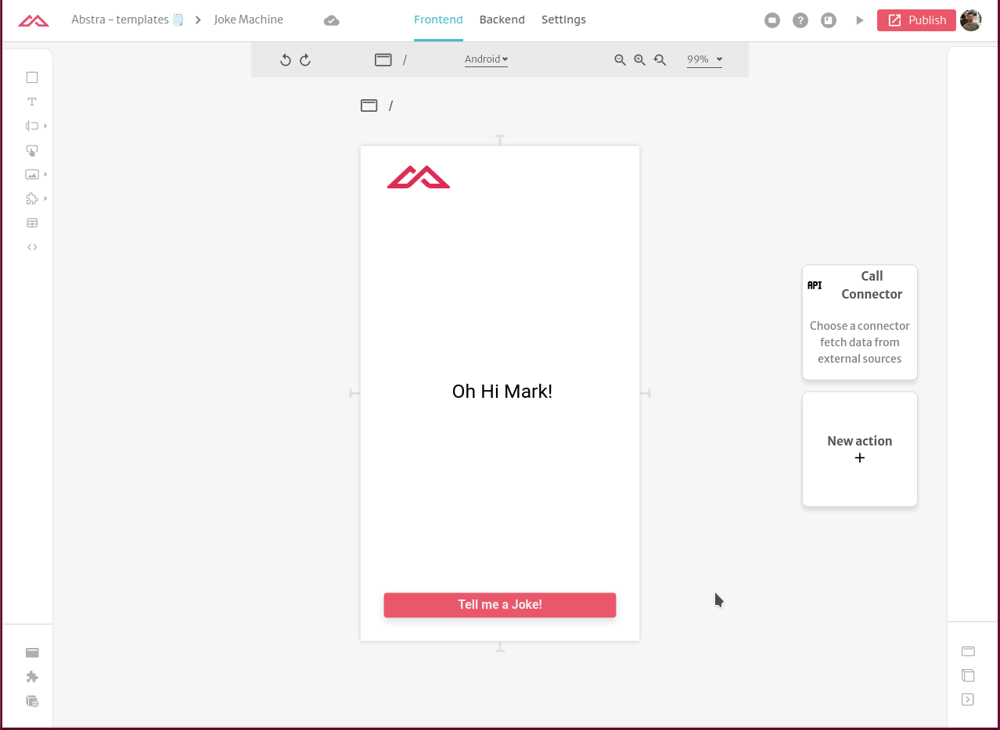
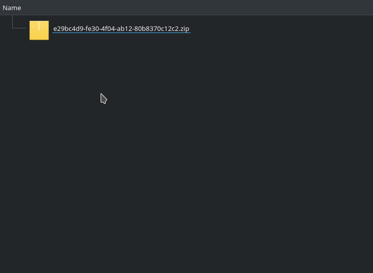
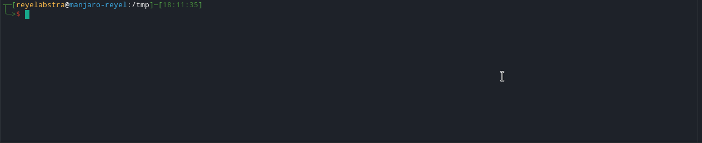
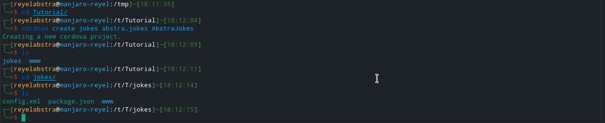
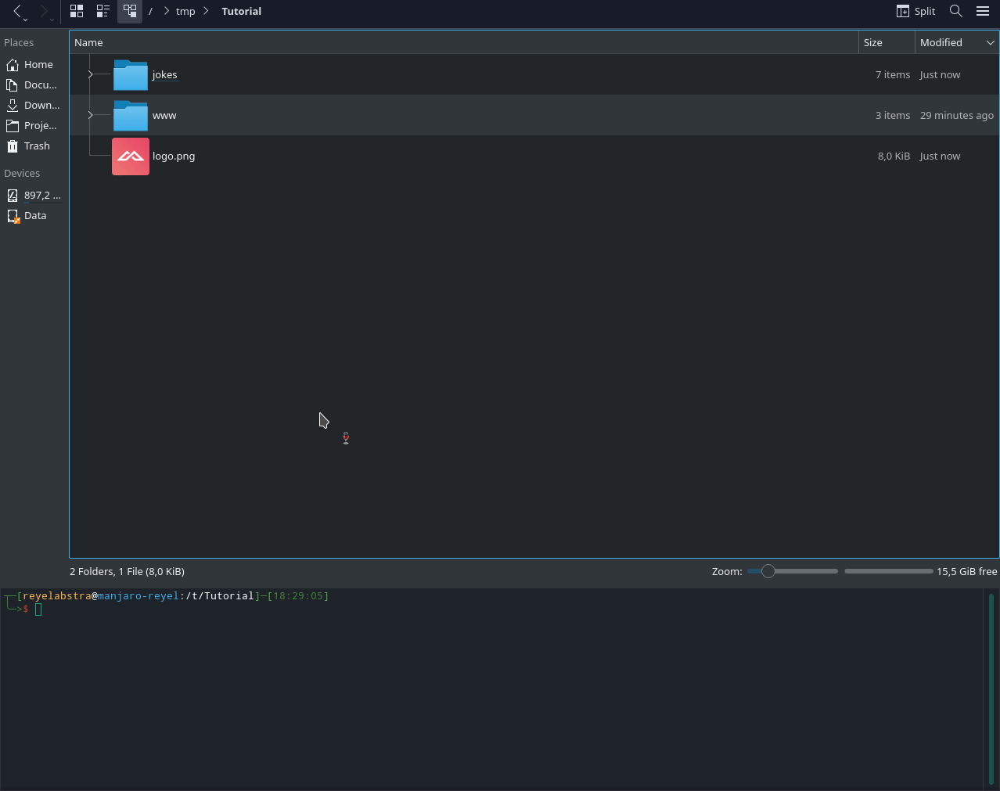
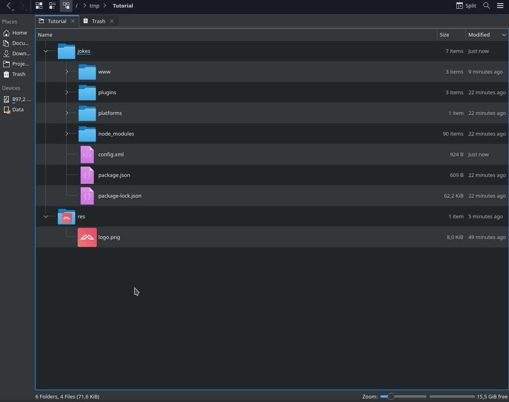
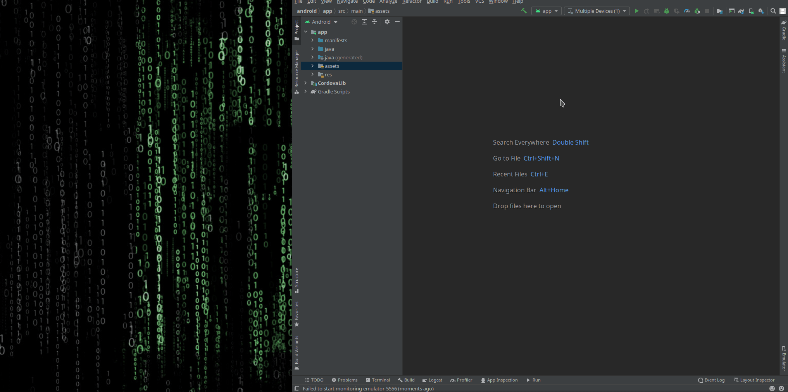
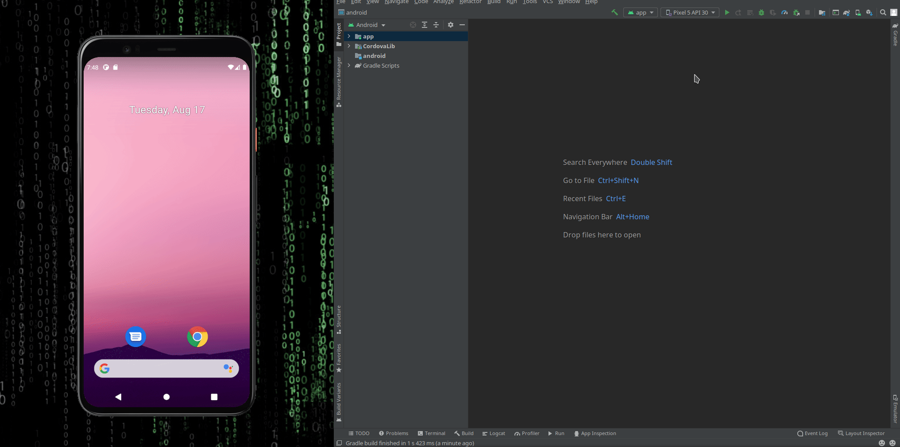

# Running Abstra apps natively on Android with Cordova

In this tutorial you will generate a working Android app from an Abstra app.

## Requirements


This is a paid feature. You are required to have an subscription to access it.


This tutorial assumes you have Android Studio working on your machine. If this is not your case, please refer to [Google's Guide](https://developer.android.com/studio/install) or [Cordova's Guide](https://cordova.apache.org/docs/en/10.x/guide/platforms/android/).

 Additionally you need to export to your path the variable `ANDROID_SDK_ROOT`. Google also has a [guide](https://developer.android.com/studio/command-line/variables) on how to do that.

Also, we will be using Cordova to convert the files. So you need to have `npm` to install the Cordova cli:

```bash
npm install -g cordova
```

## Get the bundle for your app

The first step is to get the bundle files for your Abstra app.

Enter the project editor and go to `Settings` &gt; `Releases` and scroll down to the release you want to create an Android app and download the `Android / Cordova bundle`.



Unzip the file, find the folder `www` inside and take note of that



## Starting the Cordova project

The first step is to create the Cordova project. Go to a terminal and navigate to where the project will be located and type:

```bash
cordova create <path> <namespace> <displayname>
```

After that change into the directory.



The next step is adding the android platform:

```bash
cordova platform add android
```



You can see now that there is a `platforms` folder with and `android` folder inside

Now that the project is created, replace the existing `www` folder in the root of the project with the one you downloaded previously.



### Optional Customization

Optionally you can add an icon to your app.

For this you can create a folder called `res` in the project root and place an image inside it, in our example `logo.png`. After that go to the `config.xml` file and add the following lines inside the android platform

```markup
<icon src="res/logo.png" />
```



## Building and running the App 

The final step is to build the project. To do this open a terminal on the root of the project and type

```bash
cordova build
```

This step built your android application on the folder `platforms/android`. and also created an installable APK. From here on you have many options: send the APK to your phone install it, open the application with Android Studio or tell Cordova cli to run the app.

### Using Android Studio and AVD

We will show you using Android Studio and AVD \(Android Virtual Device\). Open Android Studio then select the _AVD_ tab and launch one \(install if needed\).



After it is running, click on the play button and it will display the app on the virtual device.



### Exporting the APK

After the build is complete, Cordova exports the APK to

`<PROJECT_ROOT>/platforms/android/app/build/outputs/apk/debug/`

You can copy it and send to your devices, publish it to the Google Play Store, or modify the android project itself, if you need custom access to native resources.

