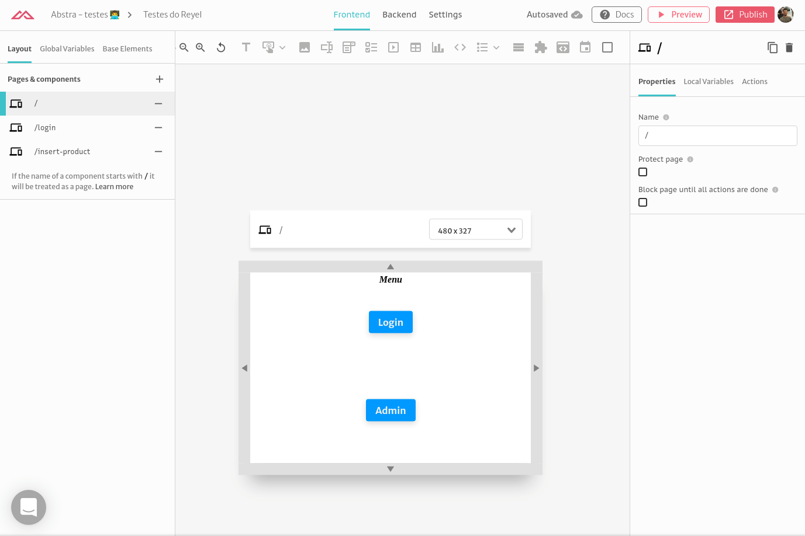
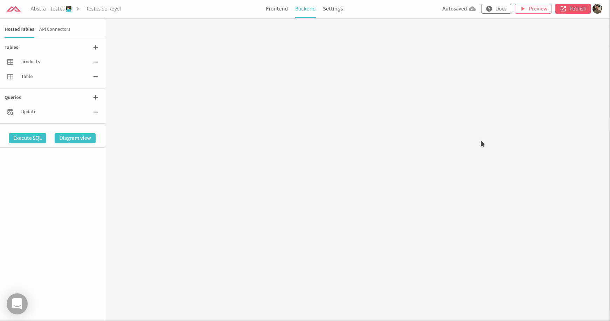
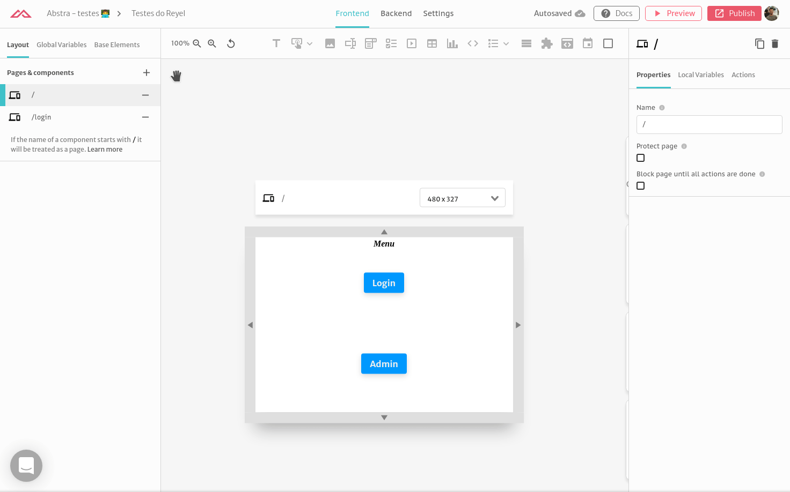
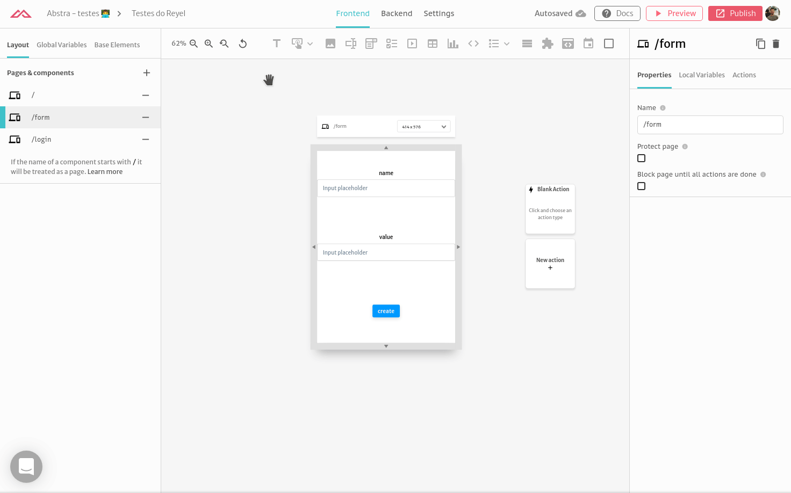
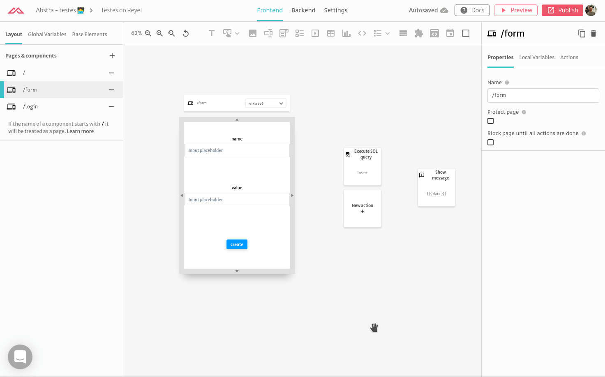

# Using Table Types

In this tutorial we will show you how to use table types with variables to create forms.

### Creating a hosted table

First you need to create a table. Go to **Backend** &gt; **Hosted Tables** and click on the add button. After you can rename it and create the columns.



Now you can create queries with this table. The following query inserts into the table **Table** from a **JSON** parameter \(PostgreSQL users the $1 notation for parameters\) with fields **name** and **value**.

```sql
insert into 
  "Table" ("name", "value") 
select 
  "name", "value" 
from 
  json_populate_record(NULL::"Table", $1)
returning *
```



Now that the query is created we can build the screens.

### Creating the form

You can start by creating the page for the form. Then add the inputs and a submit button. 



After that create a variable of type of your table, and bind the respective inputs.



Finally you can create a trigger from the button, adding an action  Execute SQL Query. Select the insert query created and fill the parameter with the created variable `{{{ tablerow }}}` . Then just add a show message action to display the result of the query `{{{ data }}}`.


That's it! Preview and test the form and you are done.



 

