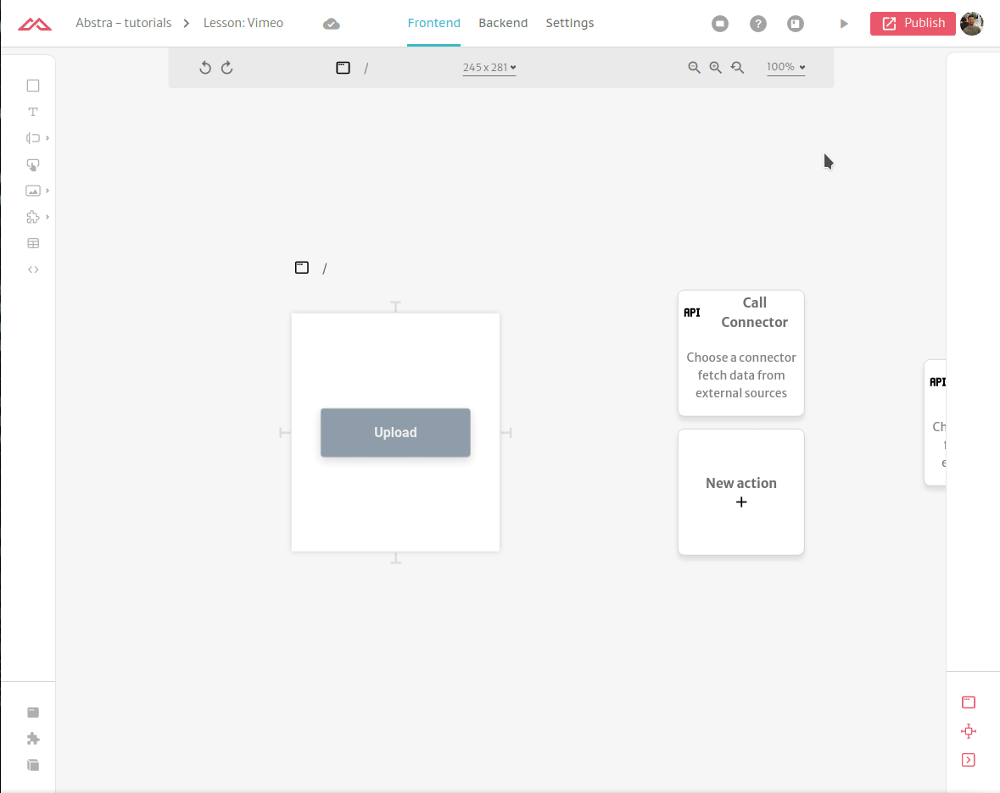

# Upload videos Vimeo using Storage Connector

In this tutorial you will learn how to create a page that a user can upload a video to your Vimeo account.

## Vimeo Setup

First we you need to register and application within Vimeo. This can be accomplished by following Vimeo's [own guide](https://developer.vimeo.com/api/guides/start#register-your-app).

Then you need to generate an **`access_token`**. This can be accomplished by following Vimeo's [own guide](https://developer.vimeo.com/api/guides/start#generate-access-token). Make sure to give this token the **`upload`** scope. After you get the token, store it some safe place.

#### Connector setup

Once you have all the information above you can now create a [REST connector](../../docs/back-end/connectors/restful-api.md).  In this tutorial we will be using the [pull approach](https://developer.vimeo.com/api/upload/videos#pull-approach) to upload to Vimeo's API. Create a connector called _`Vimeo API`_ and add  _`https://api.vimeo.com`_ as its _`base url`_. For headers add the following:

* **`Authorization`**: `bearer <access_token>`
* **`Content-Type`**: `application/json`
* **`Accept`**: `application/vnd.vimeo.*+json;version=3.4`

 (1) (1).png>)

#### Method Setup

Create a method called Submit. The **HTTP Method** should be `POST` and the **URL Path** should be `/me/videos`.

 (1) (1) (1).png>)

## Storage connector

In this tutorial the video submitted will first uploaded to an AWS S3 Bucket and then uploaded to Vimeo. For this make sure you have a fully configured [Storage connector](../../docs/back-end/connectors/storage.md) with an [upload](../../docs/back-end/connectors/storage.md#upload) method as well.

 (1) (1) (1).png>)

 (1) (1) (1).png>)

## Frontend Setup

In the frontend you will call the connectors you previously setup.

Add a button and an action `on click`. This first action should be the Storage method of upload file you previously created.

 (1) (1).png>)

On the `success` of this action add another connetor call to the Vimeo connector to submit the video. The request body should be the following:

```json
{
  "upload": {
    "approach": "pull",
    "link": "{{{ response.url }}}"
  }
}
```

 (1) (1) (1) (1).png>)

Create a global variable called `vimeoLink` and set the result of the API call in it: `$.response.link`

 (1) (1).png>)

 (1) (1).png>)

This vimeoLink variable stores the final link of the uploaded video. So if you want you can save on your database with [hosted tables](../../docs/front-end/actions/hosted-tables.md) or send an [email](../../docs/back-end/connectors/e-mail.md) to notify someone. In this tutorial you will simply redirect to it with an [External Link](../../docs/front-end/actions/external-link.md) action.

 (1) (1) (1) (1).png>)

## Testing your application

That's it. Now we just test the application.



Note that the video may not be available right away but in a few moments (depending on the video size) it will be live:

 (1) (1) (1) (1).png>)
