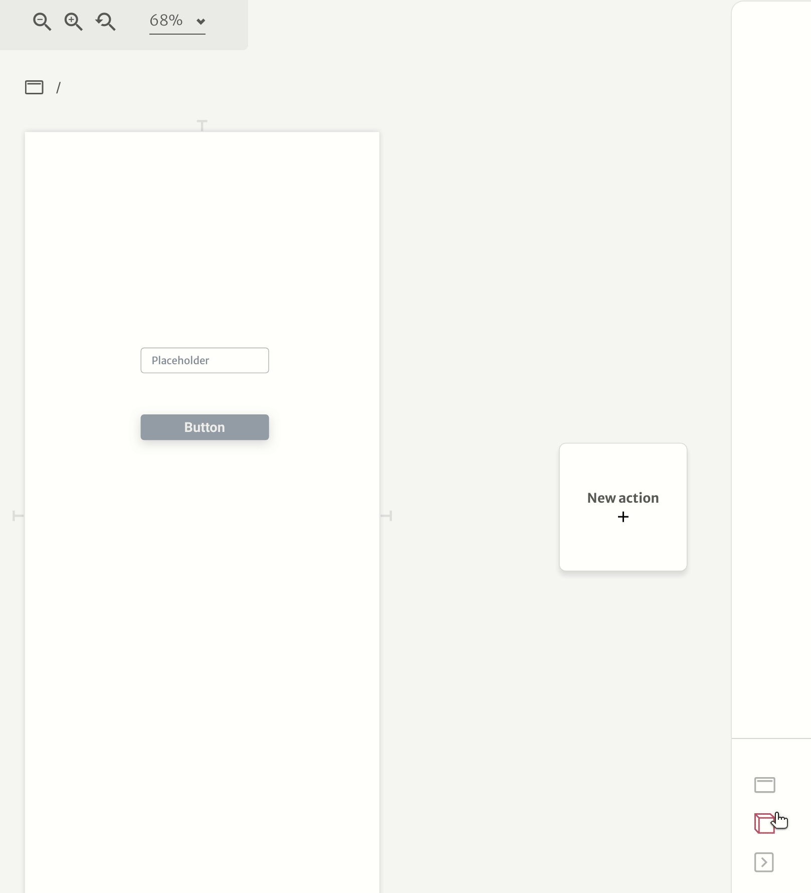

# Getting started

The first time you create a project, you see this screen.

## Components picker

This is your main utility toolbelt. Drag the components on the interface to use them.

## Canvas

This is the area where you build and see your project. Within this area, you can pan and zoom to move around.

### Pan

* Space + drag
* Middle-click + drag
* Scroll \(vertical\)
* Shift + scroll \(horizontal\)
* Two fingers swipe

### Zoom

* Ctrl + Scroll

## View frame

This is where you create your layouts. It can be a page or a component. The mechanics depend on your layout engine setup \(at the beginning of the project\).

### Elastic

Main mechanics:

### Flex

#### Size types

each flex slot have 3 options of size types

**Expand**

This makes the slot expand proportionally to its parent. Measured in %, this is great for content containers, blank areas, and other non-functional slots.

**Fixed-size**

This size type makes the size fixed in pixels, no matter its parent's size. Measured in pixels, this is great for navbars, sidebars, footers, and other navigation elements.

**Fit to content**

This size type makes the size equal to the minimum required by its content. This cannot be resized once is defined by its content only. Great for buttons, inputs, and other components in the interface.

## Actions

When you want any kind of logic on your application, you need actions. This feature allows you to call APIs, change pages, etc.

## Project inspector

This is where you can see the entities of your projects.

### Pages

### Components

These are the reutilized elements on your interface. You can use them for navbars, sidebars, footers, cards, and other repeated pieces of the layout.

### Global variables

See [variables](../docs/front-end/variables.md).

See [Local variables](getting-started.md#local-variables).

Variables are used to coordinate your application state. Just like in programming.

In Abstra, global variables are shared across the navigation.

## Selection inspector

This is the area where you can edit what is selected on the canvas.

## View inspector

This is the area where you can navigate through the entities of your view \(page or component\).

### View settings

### Local variables

See [variables](../docs/front-end/variables.md).

Variables are used to coordinate your application state. Just like in programming.

In Abstra, local variables live in one view \(page or component\).

See[ Global variables](getting-started.md#global-variables).

## Project tabs

### Frontend

This is the face of your application. This part contains the layout where your users can interact directly through the interface.

### Backend

This is the part where your users don't touch directly, this is where you store your data, send emails, access other APIs.

### Settings

General settings of your projects. In this part, you can change the project name, configure auth, and other global parameters.

## Breadcrumb navigation

You can use to navigate to your workspaces or rename the project.

## Project toolbar

### Chat

Use this chat to talk with our staff whenever you have any problems or questions about Abstra.

### Docs

This link brings to these docs \(where you are reading right now\)

### Preview

Allows you to simulate your application running, so you can easily debug what is happening

### Publish

Generate a version of your app online, so you can test it with a shareable link with your teammates.

